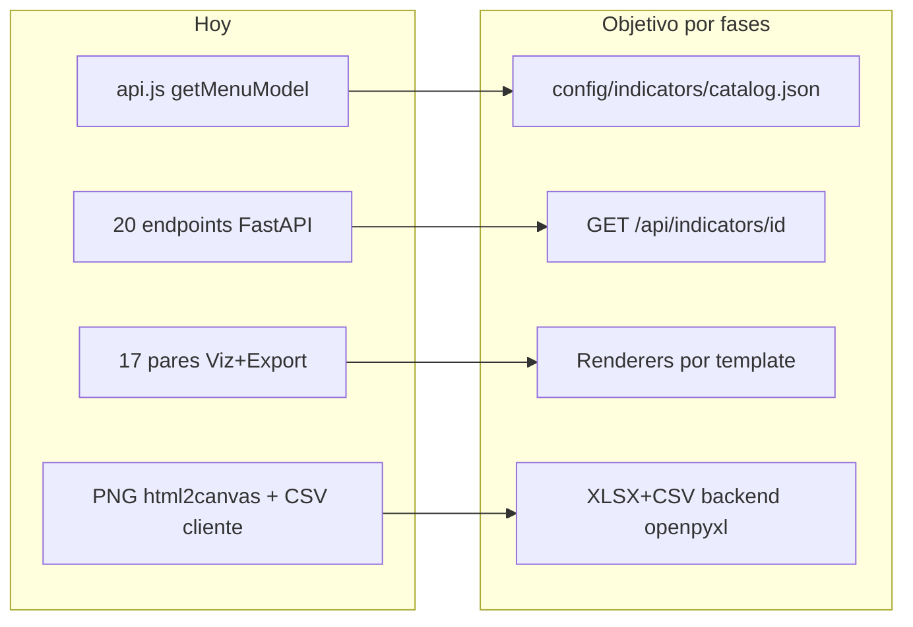

# Catálogo de indicadores del dashboard

Inventario y contrato declarativo para el motor data-driven de gráficas, tablas y exportación del Atlas GRO.

## Estado de avance

| Fase | Estado | Cambios en runtime |
|------|--------|--------------------|
| **0 · Inventario + schema + catálogo** | ✅ Completada | Ninguno |
| **1 · Catálogo cargable (backend + frontend)** | ✅ Completada | Endpoint nuevo, módulo JS nuevo |
| **1.5 · Menú lateral desde catálogo** | ✅ Completada | Menú socio/viv/eco/gov desde JSON; geo/sitios estáticos; vistas legacy intactas |
| **2 · API unificada `/api/indicators/{id}`** | ✅ Completada | Endpoint unificado + validate; rutas legacy intactas |
| **3 · Renderers genéricos (pilotos)** | ✅ Completada | Template `ranking_dual_bars` + 3 pilotos vía API unificada |
| **4 · Exportación XLSX/CSV backend** | ✅ Completada | Export openpyxl en pilotos; PNG sigue en cliente |
| **5 · Normalización ETL + validación** | ✅ Completada | Columnas precalculadas + `etl_ready: true` |
| **6 · Migración datos + export** | ✅ Completada | Todos los indicadores vía API unificada; CSV/Excel backend; PNG cliente |
| **7 · Presets de presentación** | ✅ Completada | `presentation_presets.json` + validación |
| **8 · Motor por template (17/17)** | ✅ Completada | Todas las vistas vía `runIndicatorView` + presets |
| **9 · Perfiles SQL declarativos** | ✅ Completada | Dispatch por `response_profile` (+ `handler` opcional) |
| **10 · Shell UI único** | ✅ Completada | `#dashboardIndicator` + export unificado; sin layouts por vista en runtime |
| **11 · Indicators Studio** | ✅ Completada (MVP) | Wizard admin en `indicators-studio.html` |
| **12 · Limpieza + metadatos** | ✅ Parcial | Legacy de layouts/HTML/exports por indicador retirado; botón **Metadatos** data-driven; guía de creación |
| **13 · Renderers 100 % catálogo** | ✅ Hecho | Los 6 presets pintan solo desde `fields` / `bar_metrics` / `chart_metrics` / título / footer (sin `*Viz.js`) |
| **14 · Estilos por preset** | ✅ Hecho | `presentation_presets.json` → `style.root_class` + `style.chart`; CSS autónomo `.ind-preset-mct` / `.ind-preset-grouped-bars` |
| **15 · Sin `*Viz.js` en runtime** | ✅ Hecho | Borrados 18 `*Viz.js`; `legacy` del catálogo solo `menu_flag`; tema Chart.js en `chartjsGroupedBars.js` |

Guía práctica (crear indicador + metadatos): [`GUIA_CREAR_INDICADOR.md`](./GUIA_CREAR_INDICADOR.md) · Roadmap: [`INDICADORES_ROADMAP.md`](./INDICADORES_ROADMAP.md) · Recarga ETL: [`INDICADORES_ETL.md`](./INDICADORES_ETL.md)

---

## Entregables Fase 0

| Archivo | Rol |
|---------|-----|
| `htdocs/atlas_gro/config/indicators/catalog.json` | Catálogo (18 indicadores) |
| `htdocs/atlas_gro/config/indicators/schema.json` · `config/indicators/schema.json` | JSON Schema |
| Este documento | Inventario, columnas, cálculos y roadmap |

## Entregables Fase 1

| Archivo | Rol |
|---------|-----|
| `app_api/indicators_catalog_loader.py` | Loader Python con validación ligera + cache por `mtime` |
| `app_api/routers/api.py` · `GET /api/indicators/catalog` | Endpoint FastAPI que sirve el JSON validado |
| `htdocs/atlas_gro/js/indicatorCatalog.js` | Loader ES modules con accessors (`getIndicatorsGrouped`, `getIndicatorById`, `getIndicatorByLegacyMenuFlag`, …) |
| `docker-compose.yml` | Volumen `htdocs/atlas_gro/config/indicators` → `/config/indicators` en API + env `INDICATORS_CATALOG_PATH` |

## Entregables Fase 1.5

| Archivo | Rol |
|---------|-----|
| `htdocs/atlas_gro/js/api.js` | `buildMenuModelFromCatalog()`, `getMenuModelAsync()`; puente `legacy.menu_flag` → flags booleanos de app.js |
| `htdocs/atlas_gro/js/app.js` | Bootstrap usa `await getMenuModelAsync()` |
| `htdocs/atlas_gro/js/menu.js` | Sin cambios de lógica; comentario actualizado |

### Comportamiento Fase 1.5

- **Desde catálogo:** Sociodemografía, Vivienda, Economía, Gobierno (17 ítems `enabled: true`).
- **Estático (fuera del catálogo):** Geografía (Datos geo, Visor, INV) y Sitios de interés.
- **Excluido del menú:** `geo_superficie_comparativa` (`enabled: false` en catálogo).
- **Fallback:** si falla la carga del catálogo, `getMenuModel()` estático legacy.
- **Enrutamiento:** sin cambios; cada ítem sigue llevando su flag (`poblacionComparativa`, etc.) derivado de `legacy.menu_flag`.

### Verificación Fase 1.5 (navegador, Ctrl+F5)

1. Abre el Atlas y revisa que el menú muestre las mismas 6 temáticas y ~21 ítems que antes.
2. Haz clic en **Población**, **Inversión pública** y **Datos Geográficos** — deben cargar igual que antes.
3. Consola (opcional):

```js
const { getMenuModelAsync } = await import("./js/api.js");
const m = await getMenuModelAsync();
console.log(m.map(s => s.title + ": " + s.items.length));
// Geografía: 3, Sociodemografía: 8, Vivienda: 2, Economía: 4, Gobierno: 3, Sitios de interés: 1
```

### Acción tuya (Fase 1.5)

Solo **Ctrl+F5** en el navegador (recarga de JS). No hace falta reiniciar contenedores.

## Entregables Fase 2

| Archivo | Rol |
|---------|-----|
| `app_api/indicators_service.py` | Dispatch por `indicator.id` → builders; validación catálogo ↔ BD |
| `app_api/routers/api.py` | `GET /api/indicators/{id}`, `GET /api/indicators/validate` |

### Contrato unificado

```
GET /api/indicators/{indicator_id}?cve_mun=001&nom_mun=Acapulco
GET /api/indicators/validate
```

Ejemplos en el navegador:

```
http://localhost:850/api/indicators/socio_poblacion
http://localhost:850/api/indicators/socio_poblacion?cve_mun=001
http://localhost:850/api/indicators/gov_inversion_publica?cve_mun=029
http://localhost:850/api/indicators/validate
```

Respuesta de datos = **mismo payload que la ruta legacy** + metadatos del catálogo (solo si no colisionan):

```json
{
  "ok": true,
  "indicator_id": "socio_poblacion",
  "label": "Población",
  "subtitle": "INEGI · Censos 2010 y 2020",
  "unit": "personas",
  "group_id": "socio",
  "response_profile": "ranking_municipal",
  "template": "ranking_dual_bars",
  "legacy_path": "/api/comparativas/poblacion",
  "top5": [...],
  "bottom5": [...],
  "middle": {...}
}
```

Errores:

| Código | HTTP | Cuándo |
|--------|------|--------|
| `UNKNOWN_INDICATOR` | 404 | id no está en el catálogo |
| `NOT_IMPLEMENTED` | 501 | id en catálogo sin builder (no debería ocurrir) |
| `COLUMNS_NOT_FOUND` / `NO_DATA` / `QUERY_FAILED` | 500 | mismos fallos que la ruta legacy |

### Validación (`/api/indicators/validate`)

Cruza cada `field` del catálogo con `information_schema` (vía `resolve_column` y aliases). Reporta:

- `fields_ok` / `fields_missing` por indicador
- `computed_fields` pendientes de migrar a ETL
- `has_builder` (si el id tiene implementación en el servicio)
- `summary` agregado y `valid: true|false`

### Compatibilidad Fase 2

- Rutas legacy (`/api/comparativas/*`, `/api/vistas/*`) **sin cambios**.
- Frontend sigue llamando a las rutas legacy (Fase 3 migrará a la unificada).
- El endpoint mock antiguo `GET /api/indicators?indicatorId=…` (explorador) no se toca.

### Acción tuya (Fase 2)

Reinicia el backend (código nuevo en `app_api/`; el volumen ya está montado):

```
docker compose restart api_backend
```

Luego abre en el navegador:

1. `http://localhost:850/api/indicators/socio_poblacion` — debe traer `ok: true`, `top5`, e `indicator_id`.
2. `http://localhost:850/api/indicators/validate` — debe traer `summary` y lista de indicadores.

## Entregables Fase 3

| Archivo | Rol |
|---------|-----|
| `htdocs/atlas_gro/js/indicatorEngine.js` | Fetch unificado + dispatch a templates |
| `htdocs/atlas_gro/js/templates/rankingDualBars.js` | Renderer genérico (1 o 2 métricas) |
| `htdocs/atlas_gro/js/app.js` | Pilotos usan `runIndicatorPilot(...)` |
| `catalog.json` | `migration_status: "pilot_phase3"` + `presentation.title/footer/…` |

### Pilotos migrados

| id | Template | API |
|----|----------|-----|
| `socio_poblacion` | `ranking_dual_bars` (2 métricas) | `/api/indicators/socio_poblacion` |
| `socio_edad_mediana` | `ranking_dual_bars` (1 métrica) | `/api/indicators/socio_edad_mediana` |
| `eco_unidades_economicas` | `ranking_dual_bars` (1 métrica) | `/api/indicators/eco_unidades_economicas` |

Los demás indicadores siguen en flujo legacy (`*Viz.js` + rutas `/api/comparativas/*` o `/api/vistas/*`).

Layouts del dashboard y exportación PNG/CSV de los pilotos **no cambian** (siguen `setPoblacionLayout`, `poblacionExport.js`, etc.).

### Acción tuya (Fase 3)

Solo **Ctrl+F5** (JS + catalog.json estático). No hace falta reiniciar contenedores.

## Entregables Fase 4

| Archivo | Rol |
|---------|-----|
| `app_api/indicators_export.py` | Genera CSV (`;` + BOM) y XLSX (`openpyxl`) desde payload unificado |
| `app_api/routers/api.py` | `GET /api/indicators/{id}/export?format=csv\|xlsx` |
| `htdocs/atlas_gro/js/chartExport.js` | Soporte `backendExport.indicatorId` + botón Excel |
| `poblacionExport.js` / `edadMedianaExport.js` / `unidadesEconomicasExport.js` | Pilotos usan backend |
| `index.html` | Botón **Excel** en los 3 pilotos |

### Contrato de export

```
GET /api/indicators/{id}/export?format=xlsx&cve_mun=001&nom_mun=Acapulco
GET /api/indicators/{id}/export?format=csv&cve_mun=001
```

Respuesta: archivo binario con `Content-Disposition: attachment`.

Ejemplos en el navegador (descarga directa):

```
http://localhost:850/api/indicators/socio_poblacion/export?format=xlsx
http://localhost:850/api/indicators/socio_poblacion/export?format=csv&cve_mun=001
http://localhost:850/api/indicators/gov_inversion_publica/export?format=xlsx&cve_mun=029
```

(El endpoint funciona para **todos** los indicadores del catálogo con builder; la UI de botones Excel solo está en los 3 pilotos.)

### Qué se exporta

Filas: Top 5 → Seleccionado (middle) → Bottom 5. Columnas: Sección, Clave, Municipio + `bar_metrics` del catálogo. Metadatos: título, municipio seleccionado, fecha, notas/footer.

### PNG vs datos

| Formato | Dónde | Notas |
|--------|-------|-------|
| PNG | Cliente (`html2canvas`) | Captura visual de la gráfica |
| CSV / XLSX | Backend (`openpyxl`) | Datos tabulares |

### Sobre `xlsx.full.min.js`

**No se elimina aún.** Lo sigue usando el **análisis espacial del visor** (`visorSpatialAnalysis.js`), no el dashboard de indicadores. El visor tabular ya exportaba Excel por backend. Cuando migremos el análisis espacial a openpyxl, se podrá quitar el script del `index.html`.

### Acción tuya (Fase 4)

1. Reinicia el backend:

```
docker compose restart api_backend
```

2. **Ctrl+F5** en el navegador.

3. En **Población**, **Edad mediana** y **Unidades económicas**:
   - PNG (igual que antes)
   - CSV (ahora desde el servidor)
   - **Excel** (nuevo, `.xlsx` desde el servidor)

4. Prueba directa en el navegador (opcional):

```
http://localhost:850/api/indicators/socio_poblacion/export?format=xlsx&cve_mun=001
```

Debe descargar un `.xlsx`.

## Entregables Fase 5

| Archivo | Rol |
|---------|-----|
| `sql/007_tab_municipal_etl_columns.sql` | Crea/rellena `total_unidades_medicas` y backfill de `habxpol` |
| `app_api/vistas_tab_municipal.py` | Unidades médicas: prefiere columna ETL, fallback suma |
| `app_api/indicators_service.py` | Habxpol unificado + validate con gate ETL |
| `app_api/routers/api.py` | Ruta legacy habitantes-por-policia usa el builder unificado |
| `catalog.json` | Campo `total` → `total_unidades_medicas`; `migration_status: phase5_etl` |

### Qué se normaliza

| Indicador | Antes (runtime) | Después (ETL) |
|-----------|-----------------|---------------|
| Unidades médicas | `total = imss+…+ssa` en Python | Columna `total_unidades_medicas` |
| Habitantes por policía | `habxpol = pop_tot/pol_prev` si NULL | `habxpol` siempre poblado en BD |

La API **sigue teniendo fallback** por si falta un valor, pero `/api/indicators/validate` reporta `etl_ready: false` hasta que no queden huecos.

### Documentación operativa ETL

Guía de recarga post-ETL (para el futuro): **`docs/INDICADORES_ETL.md`**

### Acción tuya (Fase 5) — ya ejecutada ✅

Desde **CMD** en `C:\Stack_Martin` (no PowerShell):

**1. Ejecutar el SQL**

```bat
type sql\007_tab_municipal_etl_columns.sql | docker exec -i db_atlas psql -U postgres -d atlas
```

Al final debe verse algo como:

```
 filas_municipales | total_um_null | habxpol_null
-------------------+---------------+--------------
                85 |             0 |            0
```

Si `habxpol_null > 0`, son municipios sin policías (`pol_prev` vacío o 0): es esperable; la API pondrá 0 en esos casos.

**2. Reiniciar el backend** (limpia caché de columnas)

```bat
docker compose restart api_backend
```

**3. Verificar en el navegador**

```
http://localhost:850/api/indicators/validate
```

Debe incluir:

- `"etl_ready": true`
- `"summary": { ..., "etl_pending": 0, "etl_ready": 2 }` (o 1 si habxpol aún tiene nulls aceptables)

Si `total_unidades_medicas` falta, verás en `etl`:

```json
{ "etl_column": "total_unidades_medicas", "status": "column_missing" }
```

**4. Probar vistas** (opcional)

- Menú → Unidades médicas en servicio
- Menú → Habitantes por policía

Deben verse igual que antes.

**5. Tras cada recarga ETL de `tab_municipal`**

Vuelve a ejecutar el mismo comando del paso 1 (el script es idempotente).

### Contrato de endpoint (Fase 1)

```
GET /api/indicators/catalog
GET /api/indicators/catalog  (sin prefijo /api también)
```

Respuesta:

```json
{
  "ok": true,
  "version": 1,
  "schema_version": "2026.1",
  "groups": [...],
  "indicators": [...],
  "data_sources": {...}
}
```

Errores: `500 CATALOG_LOAD_FAILED` con `message` descriptivo si `catalog.json` no existe o falla validación.

### Uso desde el frontend (Fase 1+)

```js
import {
  loadIndicatorsCatalog,
  getIndicatorsGrouped,
  getIndicatorById,
} from "./indicatorCatalog.js";

await loadIndicatorsCatalog();
const groups = getIndicatorsGrouped(); // [{ id, label, order, items: [...] }, ...]
const pob = getIndicatorById("socio_poblacion");
```

Estrategia de carga: primero JSON estático (`config/indicators/catalog.json`), fallback a `/api/indicators/catalog`.

### Compatibilidad Fase 1

- El catálogo quedó disponible en paralelo al menú estático (superseded en Fase 1.5).

### Requiere acción tuya (Fase 1)

1. **Reiniciar el backend** para cargar el módulo y el endpoint nuevo:

    ```bash
    docker compose restart api_backend
    ```

2. Verificar el endpoint (opcional):

    ```bash
    curl -s http://localhost:${PORT_NGINX:-850}/api/indicators/catalog | jq '.indicators | length'
    ```

    Debe devolver `18`.

3. Verificar carga en el navegador (opcional, tras Ctrl+F5):

    ```js
    import("./js/indicatorCatalog.js").then(m => m.loadIndicatorsCatalog()).then(c => console.log(c.indicators.length));
    ```

    Debe imprimir `18` en la consola.

> No hace falta rebuild de imagen: `api_backend` monta `./app_api:/app` en vivo.

---

## Alcance del catálogo

### Incluido (18 entradas)

17 indicadores activos del menú lateral + 1 preparado (`geo_superficie_comparativa`, aún no cableado en Datos Geográficos).

### Fuera de alcance (Fase 1+)

| Vista | Motivo |
|-------|--------|
| Datos Geográficos (texto + macro-mapa) | Contenido narrativo en `c_contexto`, no tabular |
| Visor geográfico | Catálogo propio en `config/visor/` |
| Inventario de viviendas (INV) | Mapa + capas vectoriales |
| Explorador municipal (Inicio) | KPIs + marginación; API `/api/explorador/municipal` |
| Sitios de interés | Enlaces externos, sin gráfica |

---

## Arquitectura actual vs objetivo



---

## Temáticas e indicadores

Las pestañas del acordeón (`socio`, `viv`, `eco`, `gov`) son **separadores de grupo**. Cada ítem del menú es un **indicador** con su propia vista, API y exportación.

### Sociodemografía (`socio`) — 8 indicadores

| ID | Template | API | Tabla principal |
|----|----------|-----|-----------------|
| `socio_poblacion` | ranking_dual_bars | `/api/comparativas/poblacion` | tab_municipal |
| `socio_crecimiento` | ranking_with_rates_table | `/api/comparativas/crecimiento` | tab_municipal |
| `socio_edad_mediana` | ranking_dual_bars | `/api/comparativas/edad-mediana` | tab_municipal |
| `socio_nacimientos` | entity_bars_municipal_table | `/api/vistas/nacimientos` | tab_nacional + tab_municipal |
| `socio_defunciones` | entity_bars_municipal_table | `/api/vistas/defunciones` | tab_nacional + tab_municipal |
| `socio_unidades_medicas` | multi_column_table | `/api/vistas/unidades-medicas` | tab_municipal |
| `socio_escolaridad` | entity_bars_municipal_table | `/api/vistas/escolaridad` | tab_nacional + tab_municipal |
| `socio_analfabetismo` | analfabetismo_composite | `/api/vistas/analfabetismo` | tab_nacional + tab_municipal |

### Vivienda (`viv`) — 2 indicadores

| ID | Template | API | Notas |
|----|----------|-----|-------|
| `viv_participacion_vivh` | ranking_with_rates_table | `/api/vistas/vivienda-participacion` | Ranking + bloques nacional/estatal |
| `viv_servicios_vivh` | chartjs_grouped_bars | `/api/vistas/vivienda-servicios` | **Único Chart.js** del dashboard temático |

### Economía (`eco`) — 4 indicadores

| ID | Template | API |
|----|----------|-----|
| `eco_poblacion_ocupada` | entity_bars_municipal_table | `/api/vistas/poblacion-ocupada` |
| `eco_caracteristicas_economicas` | multi_column_table | `/api/vistas/caracteristicas-economicas` |
| `eco_unidades_economicas` | ranking_dual_bars | `/api/vistas/unidades-economicas` |
| `eco_superficie_agricultura` | multi_column_table | `/api/vistas/superficie-agricultura` |

### Gobierno (`gov`) — 3 indicadores

| ID | Template | API |
|----|----------|-----|
| `gov_inversion_publica` | multi_column_table | `/api/vistas/inversion-publica` |
| `gov_instituciones_admin_publica` | multi_column_table | `/api/vistas/instituciones-admin-publica` |
| `gov_habitantes_por_policia` | ranking_with_rates_table | `/api/vistas/habitantes-por-policia` |

### Geografía tabular (`geo`) — 1 indicador (borrador)

| ID | Estado | Notas |
|----|--------|-------|
| `geo_superficie_comparativa` | `enabled: false` | `superficieViz.js` existe; pestaña Superficie muestra solo texto |

---

## Templates de visualización (6 arquetipos)

| Template | Descripción | Indicadores |
|----------|-------------|-------------|
| `ranking_dual_bars` | Barras CSS top5 / seleccionado / bottom5 | Población, Edad mediana, UE DENUE |
| `ranking_with_rates_table` | Barras + tabla de tasas auxiliares | Crecimiento, Vivienda part., Hab/policía |
| `entity_bars_municipal_table` | Barras por entidad federativa + tabla municipal | Nacimientos, Defunciones, Escolaridad, PEA |
| `multi_column_table` | Tabla flex multi-columna | UM, CECO, Inv. pública, IAP, Sup. agri |
| `chartjs_grouped_bars` | Chart.js agrupado Nacional/Estatal/Municipio | Vivienda servicios |
| `analfabetismo_composite` | 3 columnas (2010/2020 entidad + ranking + tabla) | Analfabetismo |

**Patrón de respuesta común (ranking):** `{ ok, top5, bottom5, middle, selected_in_top, selected_in_bottom, cve_mun_selected }`

**Patrón con entidades:** añade `states[]` con `{ ent, nom_ent, estatal_si, …métrica }`

---

## Exportación actual

| Formato | Implementación | Alcance |
|---------|----------------|---------|
| **PNG** | `chartExport.js` + `html2canvas` | 17 indicadores |
| **CSV** | `buildCsv()` en cada `*Export.js` (cliente) | 17 indicadores; separador `;`, BOM UTF-8 |
| **XLSX** | `xlsx.full.min.js` (cliente) | Solo análisis espacial del visor |
| **XLSX** | `openpyxl` backend | Visor tabular `/api/visor/tabla/export` |

**Decisión Fase 4:** CSV y XLSX del dashboard → backend (`pandas`/`openpyxl`). PNG permanece en cliente. Retirar `xlsx.full.min.js` al migrar análisis espacial.

---

## Fuentes de datos PostgreSQL

### `atlas.tab_municipal`

Tabla ancha ETL. Filas especiales:

- `nom_mun = 'Nacional'` — totales nacionales
- `nom_mun = 'Estatal'` — totales de Guerrero
- `cve_mun` 001–085 — municipios

Columnas clave por dominio (nombre **canónico** acordado en catálogo):

| Dominio | Columnas |
|---------|----------|
| Demografía | `pob_tot`, `pob_tot_2010`, `dist_porc`, `creci_00_10`, `creci_10_20`, `edad_mediana` |
| Natalidad/mortalidad mun. | `por_naci_2024_redo`, `por_def_2024_redo` |
| Educación mun. | `graproes`, `tasa_an_red` |
| Salud | `imss`, `issste`, `semar`, `imb`, `sesa`, `ssa` |
| Vivienda | `part_por_vivh`, `por_redo_ener`, `por_redo_agua`, `por_redo_drenaje` |
| Economía | `ue`, `pers_ocup`, `prod_brut`, `ue_den`, `sup_semb*` |
| Empleo mun. | `ocupada`, `sin_escol`, `primaria`, `secund`, `med_sup`, `superior`, `no_esp` |
| Gobierno | `total_inv`, `gob_inv`, …, `total_inst`, `personal`, `habxpol`, `pol_prev` |

### `atlas.tab_nacional`

Indicadores por entidad federativa (01–32) + filas nacional/Guerrero.

| Uso | Columnas |
|-----|----------|
| Nacimientos | `naci_24`, `por_naci24` |
| Defunciones | `defu`, `por_def_ent` |
| Escolaridad | `graproes` |
| Analfabetismo | `tasa_an2010`, `tasa_an2020` |
| PEA ocupada | `pea_ocup` |

### `atlas.c_mun`

Marco municipal PostGIS. Superficie comparativa: `porcsup`.

---

## Columnas con alias legacy (`column_resolver`)

Hoy la API prueba varios nombres por columna vía `information_schema`. El catálogo fija un **nombre canónico** y documenta alias solo para transición.

Ejemplos críticos:

| Canónico | Alias aceptados hoy |
|----------|---------------------|
| `pob_tot` | `pop_tot`, `POP_TOT` |
| `por_naci_2024_redo` | `porc_naci_2024_redo`, `por_naci_2024` |
| `graproes` | `GRAPROES`, `gra_proes` |
| `inst_parampal` | `inst_paramuni` |

**Meta Fase 5:** ETL entrega solo nombres canónicos; validación falla si falta columna.

---

## Cálculos en API → migrar a ETL

| Cálculo | Dónde | Propuesta ETL |
|---------|-------|---------------|
| `total = imss+issste+…` | `build_unidades_medicas_response` | Columna `total_unidades_medicas` |
| `habxpol_eff = pob_tot/pol_prev` | `habitantes_policia` en `api.py` | Asegurar columna `habxpol` precalculada |
| `densidad = pob_tot/sup_km2` | `explorador.py` (Inicio) | Columna `densidad_hab_km2` |
| Ranking top5/bottom5/middle | `ranking.py` | **Permanece en API** (presentación) |
| Sort/filter estados | `vistas_*.py` | **Permanece en API** (presentación) |

Principio rector: *lo que el usuario ve como indicador debe existir en BD; la API ordena y formatea.*

---

## Mapa código legacy → catálogo

Cada entrada del catálogo incluye bloque `legacy` con:

- `menu_flag` — flag booleano en `getMenuModel()` / `app.js`
- `dashboard_id` — contenedor DOM en `index.html`
- `viz_module` / `export_module` — par JS actual
- `layout_fn` — toggle en `dashboard.js`
- `fetch_fn` — cliente en `api.js`

Referencia completa: `config/indicators/catalog.json`.

---

## Perfiles de respuesta API (`response_profile`)

| Perfil | Claves extra típicas |
|--------|----------------------|
| `ranking_municipal` | top5, bottom5, middle |
| `ranking_with_states` | + states, por_entidad_guerrero |
| `ranking_with_national_state` | + tabla_nacional, tabla_entidad / nacional, estatal |
| `national_state_municipio` | nacional, estatal, municipio (objetos planos) |
| `ranking_entity_only` | + entidad (unidades médicas) |

---

## Roadmap de fases

| Fase | Entregable | Acción tuya |
|------|------------|-------------|
| **0** ✅ | Doc + catalog.json + schema.json | Ninguna (archivos estáticos) |
| **1** ✅ | Loader Python, endpoint API, loader JS | `docker compose up -d api_backend` (solo una vez) |
| **1.5** ✅ | Menú lateral desde catálogo (compat dual) | Ctrl+F5 |
| **2** ✅ | `GET /api/indicators/{id}` + `/validate` | `docker compose restart api_backend` |
| **3** ✅ | Template `ranking_dual_bars` + 3 pilotos | Ctrl+F5 |
| **4** ✅ | Export XLSX/CSV backend (pilotos) | `docker compose restart api_backend` + Ctrl+F5 |
| **5** ✅ | Columnas ETL + gate `etl_ready` | Ejecutar `sql/007_…sql` + restart API |
| **6** ✅ | API unificada + export backend en todas las vistas | `restart api_backend` + Ctrl+F5 |
| **7** | Templates genéricos restantes + limpieza `*Viz.js` | QA visual |
| **8** | Admin indicadores (opcional) | — |

---

## Validación del catálogo (manual)

```bash
# Listar columnas reales en BD (requiere API en marcha)
curl -s "http://localhost/api/poblacion/columns" | jq '.columns | length'

# Fase 1: verificar catálogo servido
# (en navegador) http://localhost:850/api/indicators/catalog

# Fase 2: API unificada y validación
# http://localhost:850/api/indicators/socio_poblacion?cve_mun=001
# http://localhost:850/api/indicators/validate
```

---

## Entregables Fase 6

| Pieza | Rol |
|-------|-----|
| `docs/INDICADORES_ETL.md` | Recarga ETL documentada para el futuro |
| `app.js` | **Todos** los indicadores cargan con `fetchIndicatorData` / `runIndicatorPilot` |
| `*Export.js` + `indicatorExportFactory.js` | CSV/Excel vía `/api/indicators/{id}/export` |
| `index.html` | Botón **Excel** en todas las vistas de indicadores |
| `indicators_export.py` | Export ampliado (entidad, nacional, states, municipio) |

### Qué quedó migrado

| Capa | Estado |
|------|--------|
| Datos (API) | 100% unificada (`GET /api/indicators/{id}`) |
| Export CSV/XLSX | 100% backend (`openpyxl`) |
| Export PNG | Cliente (`html2canvas`) — intencional |
| Render visual | Híbrido: 3 pilotos con template `ranking_dual_bars`; resto aún usa `*Viz.js` legacy con el **mismo payload** unificado |

### Qué NO se hizo aún (siguiente iteración)

- Templates genéricos para `multi_column_table`, `entity_bars_municipal_table`, `analfabetismo_composite`, `chartjs_grouped_bars`
- Borrar módulos `*Viz.js` legacy
- Quitar `xlsx.full.min.js` (sigue usándolo el análisis espacial del visor)

### Acción tuya (Fase 6)

1. Reinicia el backend (export ampliado):

```bat
docker compose restart api_backend
```

2. **Ctrl+F5** en el navegador.

3. Prueba al menos:
   - Un piloto (Población): PNG / CSV / Excel
   - Una vista no piloto (Inversión pública o Nacimientos): gráfica igual + CSV/Excel desde servidor
   - `http://localhost:850/api/indicators/gov_inversion_publica/export?format=xlsx&cve_mun=029`

## Entregables Fase 7

| Archivo | Rol |
|---------|-----|
| `config/indicators/presentation_presets.json` | 6 presets + reserved/alias |
| `presentation_presets.schema.json` | Schema del catálogo de presets |
| `schema.json` | `presentation` ampliado (title, footer, metrics, …) |
| `app_api/presentation_presets_loader.py` | Carga + ids activos |
| `GET /api/indicators/presentation-presets` | Endpoint |
| `js/presentationPresets.js` | Loader frontend |
| `docs/INDICADORES_PRESENTACION.md` | Contrato de cada estilo |

### Acción tuya (Fase 7)

```bat
docker compose restart api_backend
```

Verificar:

```
http://localhost:850/api/indicators/presentation-presets
http://localhost:850/api/indicators/validate
```

En validate, `presentation.presets_implemented` debe ser `1` y `presets_catalog_only` `5`. Las 17 vistas se ven igual (sin cambios visuales).

## Entregables Fase 8

| Pieza | Rol |
|-------|-----|
| `js/templates/*.js` | Un módulo por preset (6/6 `implemented`) |
| `indicatorEngine.js` | Despacho por `presentation.template` |
| `app.js` | Las 17 vistas activas usan solo `runIndicatorView(id, …)` |

**Nota honesta:** los templates de Fase 8 **adaptan** a los `*Viz.js` existentes (misma UI/CSS por indicador). El enrutado es 100 % data-driven (`catalog → template → renderer`). La unificación de CSS y el borrado de `*Viz.js` quedan para Fase 10.

### Acción tuya (Fase 8)

Solo **Ctrl+F5**. No hace falta reiniciar contenedores (solo JS).

Verifica los 17 indicadores (aspecto igual) y:

```
http://localhost:850/api/indicators/validate
```

`presentation.presets_implemented` debe ser **6** y `presets_catalog_only` **0**.

## Entregables Fase 9

| Pieza | Rol |
|-------|-----|
| `app_api/indicator_profiles.py` | Perfiles genéricos + handlers especiales |
| `indicators_service.py` | Despacha por `api.response_profile` / `api.handler` |
| `catalog.json` | `handler` en analfabetismo, escolaridad, población ocupada |

### Perfiles registrados

| `response_profile` | Uso |
|--------------------|-----|
| `ranking_municipal` | top/middle/bottom desde `tab_municipal` o `c_mun` |
| `ranking_with_national_state` | + `tabla_nacional` / `tabla_entidad` (y alias `nacional`/`estatal`) |
| `ranking_entity_only` | + `entidad` (estatal) |
| `national_state_municipio` | objetos nacional/estatal/municipio |
| `ranking_with_states` | `states[]` desde `tab_nacional` + ranking municipal |

Handlers opcionales (`api.handler`): `analfabetismo`, `escolaridad`, `poblacion_ocupada` (payloads aún no generalizados).

**Criterio:** un indicador nuevo con perfil existente **no requiere Python** (solo JSON). Los 3 handlers son la excepción documentada.

### Acción tuya (Fase 9)

```bat
docker compose restart api_backend
```

Verificar:

```
http://localhost:850/api/indicators/validate
```

Debe incluir `summary.profiles_registered: 5`, `handlers_registered: 3`, `valid: true`.

Probar un indicador genérico y uno con handler:

```
http://localhost:850/api/indicators/socio_poblacion?cve_mun=001
http://localhost:850/api/indicators/socio_analfabetismo?cve_mun=001
```

Las 17 vistas (Ctrl+F5) deben verse igual.

## Entregables Fase 10

| Pieza | Rol |
|-------|-----|
| `#dashboardIndicator` en `index.html` | Shell único (título, meta, PNG/CSV/Excel, viz root) |
| `js/indicatorShell.js` | Layout + `showCatalogIndicator` + export dinámico |
| `app.js` | Enruta indicadores del catálogo por `id` (sin flags en el camino activo) |

**Runtime activo:** menú → `isCatalogTabularIndicator(id)` → shell → `runIndicatorView` → perfil SQL → template.

Los bloques legacy por indicador en `app.js` / HTML quedan **inalcanzables** para los 17 indicadores (se pueden borrar en Fase 12). Geo, Visor, INV y Sitios siguen por su camino especial.

### Acción tuya (Fase 10)

Solo **Ctrl+F5**.

1. Abre varios indicadores: el título del card debe cambiar; un solo panel.
2. PNG / CSV / Excel desde el shell.
3. Cambia de municipio con un indicador abierto: debe recargar.
4. Geo / Visor / Inicio: deben seguir funcionando.

## Rendimiento al cambiar municipio

Tras Fase 10, el cambio de municipio con un indicador activo usa `refreshCatalogIndicator` (solo datos + meta, sin rearmar layout ni teardowns de mapa/visor). La opacidad del panel baja brevemente mientras llega la respuesta; peticiones viejas se ignoran si el usuario cambia de municipio otra vez antes de que termine la anterior.

## Entregables Fase 11 (MVP)

| Pieza | Rol |
|-------|-----|
| `indicators-studio.html` | UI admin (login = misma sesión Visor Studio) |
| `js/indicatorsStudioApp.js` | Listar / crear / editar / eliminar / preview |
| `app_api/routers/indicators_admin.py` | API admin autenticada |
| `app_api/indicators_admin_service.py` | Lectura/escritura de `catalog.json` |
| `docker-compose.yml` | Volumen indicators en **rw** (para publicar) |

### Acción tuya (Fase 11)

Recrear el backend (volumen rw + router nuevo):

```bat
docker compose up -d api_backend
```

Abrir:

```
http://localhost:850/atlas_gro/indicators-studio.html
```

(o el path público que uses para `atlas_gro`). Entrar con el mismo usuario admin de Visor Studio.

1. Listar indicadores existentes.
2. **+ Nuevo**: id, grupo, perfil, preset, campos (`key|column|label|type|tabla`).
3. **Publicar** → escribe `catalog.json` (backup `.bak`).
4. **Ctrl+F5** en el Atlas para ver el menú actualizado.
5. **Vista previa JSON** prueba el endpoint de datos.

Enlace también desde Visor Studio → botón **Indicators Studio**.

## Auditoría (Indicators Studio)

Las acciones de publicar, editar y eliminar indicadores se registran en **`atlas_admin.catalog_audit`** (la misma tabla que Visor Studio; no requiere migración nueva).

| `action` | Descripción |
|----------|-------------|
| `create_indicator` | Creó un indicador nuevo |
| `update_indicator` | Publicó cambios de un indicador existente |
| `delete_indicator` | Eliminó un indicador del catálogo |
| `replace_catalog` | Reemplazó el catálogo completo (`PUT /catalog`) |

Cada fila guarda: usuario, acción, `layer_id` = id del indicador, JSON antes/después, fecha.

- **UI:** Indicators Studio → panel **Registro de actividad**
- **API:** `GET /api/indicators/admin/audit?limit=60` (filtros: `action`, `indicator_id`)
- El registro del Visor **no** mezcla estas acciones (se filtran al listar).

## Metadatos (data-driven)

Cada indicador del catálogo puede declarar un bloque `metadata` (ver `$defs.metadata` en `schema.json`):

| Campo | Tipo | Rol |
|-------|------|-----|
| `enabled` | boolean | Si `false`, oculta el botón en el shell |
| `title` | string | Título del panel (por defecto el `label`) |
| `summary` | string | Resumen breve |
| `body` | string | Descripción completa (espacio de redacción) |
| `source` | string | Fuente / citación |
| `notes` | string | Notas metodológicas |
| `updated` | string | Periodo o fecha de actualización |

**UI Atlas:** botón `#btnIndicatorMetadata` (píldora ámbar discreta) en `#dashboardIndicator`; panel `#indicatorMetadataPanel` rellenado por `indicatorShell.js`. Campos vacíos muestran placeholder de redacción.

**Wizard:** bloque **Metadatos** en `indicators-studio.html` (campos `fMeta*`); se persiste al **Publicar**.

**Guía de uso:** [`GUIA_CREAR_INDICADOR.md`](./GUIA_CREAR_INDICADOR.md).

## Limpieza legacy (Fase 12 parcial)

Retirado del camino activo:

- Layouts por indicador en `dashboard.js` (quedan Home, Geo, Visor, InvViv, Sitios, Normal).
- HTML de dashboards por indicador en `index.html` (solo `#dashboardIndicator` para tabulares).
- Módulos `*Export.js` por indicador e `indicatorExportFactory.js` (export unificado vía `chartExport.js` + backend).

El bloque `legacy` del catálogo solo conserva `menu_flag` (menú). Quedan 3 handlers API especiales (`analfabetismo`, `escolaridad`, `poblacion_ocupada`) y clases CSS de layout en `main.css` referenciadas por preset.

## Próximo paso

→ Redactar textos en `metadata.*` de cada indicador (Studio o catálogo) · unificar CSS de templates si se desea retirar `*Viz.js`. Roadmap: [`INDICADORES_ROADMAP.md`](./INDICADORES_ROADMAP.md)
