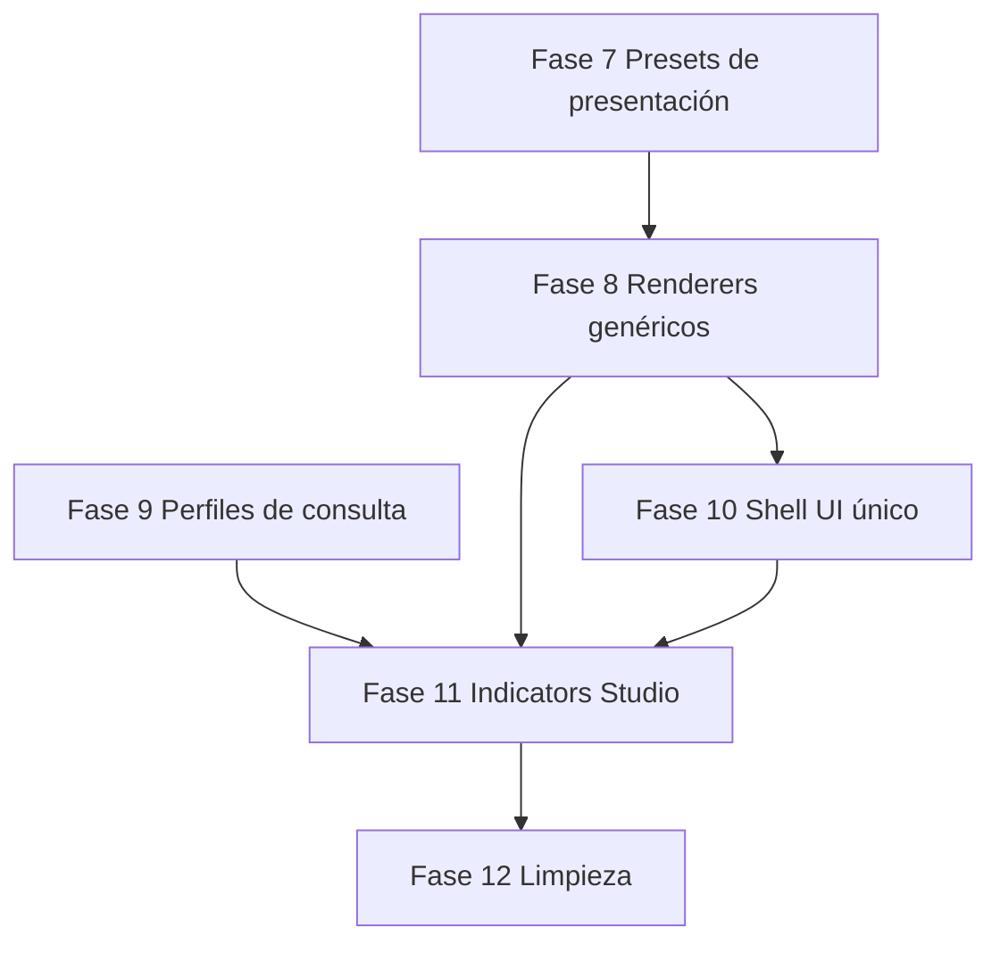

# Roadmap: indicadores 100 % data-driven → Indicators Studio

Objetivo final: un **wizard tipo Visor Studio** donde un usuario autorizado construya indicadores nuevos (datos, presentación, export) **sin tocar código**, solo editando catálogos validados.

Este documento define el camino **después de las fases 0–6** (datos + export unificados, presentación aún híbrida).

---

## Dónde estamos (hoy)

| Capa | Estado |
|------|--------|
| Catálogo `catalog.json` | ✅ Existe (18 indicadores) |
| Menú socio/viv/eco/gov | ✅ Desde catálogo |
| API `GET /api/indicators/{id}` | ✅ Unificada |
| Export CSV/XLSX backend | ✅ Unificado |
| ETL + `validate` | ✅ Gate operativo |
| Presets de presentación (contrato) | ✅ Fase 7 (`presentation_presets.json`) |
| **Presentación (gráficas/tablas)** | ⚠️ Solo 3/17 con template genérico |
| **Builders Python por indicador** | ⚠️ Aún hay lógica por `id` en `indicators_service.py` |
| **Layout / flags / HTML por vista** | ⚠️ Legacy (`*Viz.js`, `setXxxLayout`, flags) |
| **Wizard admin** | ❌ No existe |

Analogía con el visor geográfico:

| Visor (ya maduro) | Indicadores (meta) |
|-------------------|--------------------|
| `config/visor/catalog.json` | `config/indicators/catalog.json` |
| `style_preset` + presets genéricos | `presentation.template` + **presets de presentación** |
| `visorStyleRegistry` monta capas | `indicatorEngine` monta vistas |
| Visor Studio (wizard) | **Indicators Studio** (wizard) |

---

## Principio rector

> **Nada de negocio en el frontend ni en handlers sueltos.**  
> Todo indicador = entrada de catálogo + perfil de datos + preset de presentación + export.  
> El código solo interpreta catálogos.

Los estilos de gráficas/tablas **no se inventan desde cero**: se **catalogan** a partir de lo que ya existe en los `*Viz.js` actuales.

---

## Inventario de presets de presentación (lo que ya tenemos)

Extraído de los 17 indicadores activos:

| Preset (`presentation.template`) | # usos | Qué representa (hoy en `*Viz.js`) | Indicadores ejemplo |
|----------------------------------|--------|-----------------------------------|---------------------|
| `ranking_dual_bars` | 4 | Barras top5 / middle / bottom5, 1–2 métricas | Población, Edad mediana, UE DENUE, (superficie) |
| `ranking_with_rates_table` | 3 | Barras + tabla de tasas/columnas extra | Crecimiento, Viv. participación, Hab×policía |
| `entity_bars_municipal_table` | 4 | Barras por entidad (states) + ranking municipal | Nacimientos, Defunciones, Escolaridad, Pob. ocupada |
| `multi_column_table` | 5 | Tabla multi-columna + top/middle/bottom (+ entidad) | Unidades médicas, Caract. económicas, Agricultura, Inversión, Inst. admin |
| `chartjs_grouped_bars` | 1 | Chart.js: nacional / estatal / municipio | Servicios en vivienda |
| `analfabetismo_composite` | 1 | Compuesto: estados 2010/2020 + ranking municipal | Analfabetismo |

Cada preset debe vivir como **contrato declarativo** (JSON Schema + renderer), no como archivo JS por indicador.

---

## Fases nuevas (7 → 12)

### Fase 7 — Catálogo de presets de presentación ✅

**Meta:** formalizar los 6 estilos como catálogo, sin migrar aún todas las vistas.

**Hecho:** `presentation_presets.json`, schemas, validación al cargar catálogo, `GET /api/indicators/presentation-presets`, `js/presentationPresets.js`, doc `INDICADORES_PRESENTACION.md`.

**Criterio de salida:** un humano (o el wizard futuro) puede elegir un preset y saber exactamente qué campos configurar. Runtime visual aún usa `*Viz.js` salvo los 3 pilotos de `ranking_dual_bars`.

**Acción tuya:** `docker compose restart api_backend` + verificar `/api/indicators/presentation-presets` y `validate`.

---

### Fase 8 — Renderers genéricos (cero `*Viz.js` en runtime)

**Meta:** las 17 vistas se pintan solo con `indicatorEngine` + presets.

Entregables:

1. Un módulo por preset en `js/templates/`:
   - `rankingDualBars.js` ✅ (ya existe)
   - `rankingWithRatesTable.js`
   - `entityBarsMunicipalTable.js`
   - `multiColumnTable.js`
   - `chartjsGroupedBars.js`
   - `analfabetismoComposite.js` (o generalizar a `dual_period_states_plus_ranking` si aplica)
2. **Shell único de dashboard** (`dashboardIndicatorShell`): un solo contenedor HTML; título, meta, botones PNG/CSV/Excel salen del catálogo.
3. **Enrutado por `indicator.id`** en `app.js` (eliminar flags `poblacionComparativa`, etc.).
4. Migrar los 17 a `runIndicatorView(id, …)`; retirar imports de `*Viz.js`.
5. CSS compartido (tokens de `.poblacion-viz`, badges top/bottom, tablas) en una hoja de presentación, no por indicador.

**Criterio de salida:** borrar (o dejar de cargar) los 17 `*Viz.js` sin cambiar el aspecto visual.

**Acción tuya:** Ctrl+F5 + QA visual de los 17.

---

### Fase 9 — Perfiles de consulta declarativos (cero builder por `id`) ✅

**Hecho:** `indicator_profiles.py` con 5 perfiles genéricos + 3 handlers declarativos (`api.handler`). `indicators_service` ya no mapea por `indicator.id`.

**Meta (cumplida):** el backend no tenga un `if indicator_id == …` por indicador.

Hoy `indicators_service.py` registra 18 builders. Debe quedar:

```
catalog.api.response_profile + catalog.fields + catalog.presentation.sort_by
        ↓
perfil genérico (SQL / ranking / states / NSM)
        ↓
payload normalizado
```

Perfiles a implementar (ya nombrados en el catálogo):

| `response_profile` | Origen de datos |
|--------------------|-----------------|
| `ranking_municipal` | `tab_municipal`, top/middle/bottom |
| `ranking_with_rates_table` | igual + columnas extra en fila |
| `ranking_with_states` | `tab_nacional` (states) + ranking municipal |
| `ranking_with_national_state` | ranking + filas nacional/entidad |
| `ranking_entity_only` | entidad + ranking (unidades médicas) |
| `national_state_municipio` | 3 objetos planos (servicios vivienda) |

Entregables:

1. `app_api/indicator_profiles.py` — un builder por **perfil**, no por indicador.
2. `indicators_service` solo despacha: `profile = ind["api"]["response_profile"]`.
3. Campos, aliases y `sort_by` salen del catálogo (`fields`, `column_aliases`).
4. Tests/validate: perfil desconocido → error claro.

**Criterio de salida:** agregar un indicador nuevo al JSON (mismo perfil existente) **sin escribir Python**.

**Acción tuya:** `docker compose restart api_backend` + validate.

---

### Fase 10 — UI 100 % desde catálogo (menú, shell, grupos)

**Meta:** no quede HTML/JS específico por indicador en el dashboard.

Entregables:

1. Un solo bloque en `index.html`: `#dashboardIndicator` (header + actions + viz root).
2. Grupos del menú, orden, `enabled`, subtítulos: solo catálogo.
3. Entradas especiales (Datos geográficos, Visor, INV, Sitios) como `type: "special"` en catálogo o catálogo hermano — **declaradas**, no hardcode en `MENU_SECTION_GEO` eterno.
4. Eliminar `setPoblacionLayout` / `setCrecimientoLayout` / … (un `setIndicatorLayout(active)`).
5. Eliminar `*Export.js` por indicador (un solo `indicatorExport.js` leyendo catálogo).

**Criterio de salida:** el frontend del dashboard de indicadores cabe en pocos módulos genéricos (`indicatorCatalog`, `indicatorEngine`, `indicatorShell`, `templates/*`).

**Acción tuya:** Ctrl+F5 + QA menú y navegación.

---

### Fase 11 — Indicators Studio (wizard admin)

**Meta:** wizard como Visor Studio para crear/editar indicadores.

Pasos del wizard (propuesta, espejo del visor):

| Paso | Contenido |
|------|-----------|
| 1. Identidad | `id`, `label`, `subtitle`, `group_id`, `unit`, `enabled` |
| 2. Fuente | tabla(s) (`tab_municipal` / `tab_nacional` / `c_mun`), alcance |
| 3. Campos | mapear columnas BD → `fields[]` (aliases, tipo, label) |
| 4. Perfil de datos | elegir `response_profile` (lista de perfiles registrados) |
| 5. Presentación | elegir `presentation.template` + configurar métricas/secciones/título/footer |
| 6. Export | `filename_prefix`, formatos, columnas CSV |
| 7. Vista previa | llama `GET /api/indicators/{id}?cve_mun=…` y renderiza con el engine |
| 8. Publicar | escribe `catalog.json` + invalida caché (como Visor Studio) |

Entregables backend:

- `GET/PUT /api/indicators/admin/catalog`
- `GET /api/indicators/admin/tables` / `columns` (information_schema)
- `POST /api/indicators/admin/preview` (payload sin persistir)
- Auth igual que admin del visor (JWT / sesión admin)

Entregables frontend:

- `indicatorsStudio.js` + modal/pasos (reutilizar patrones de `visorCatalogAdmin.js`)
- Validación cliente + servidor contra `schema.json` + presets

**Criterio de salida:** un admin crea un indicador nuevo (perfil+template existentes), publica, y aparece en el menú sin deploy de código.

**Acción tuya:** login admin, prueba de crear/editar un indicador de prueba.

---

### Fase 12 — Limpieza y gobierno

1. Borrar `*Viz.js` / `*Export.js` / flags legacy / layouts muertos.
2. Documentar contrato estable (versionar `schema_version`).
3. Política ETL: todo `computed_field` con `migrate_to_etl` debe pasar `validate` antes de producción (ya iniciado en Fase 5).
4. (Opcional) Migrar análisis espacial del visor a openpyxl y quitar `xlsx.full.min.js`.
5. (Opcional) Permisos por rol en Indicators Studio.

---

## Orden recomendado y dependencias



- **7 → 8 → 10** cierran el frontend data-driven.  
- **9** puede ir en paralelo a 8 (recomendado empezar 9 apenas 7 esté claro, para que el wizard no dependa de builders por id).  
- **11** solo cuando 8+9+10 den un motor que el wizard pueda invocar sin casos especiales.  
- **12** al final.

---

## Qué no hacer

- No crear un `*Viz.js` nuevo por indicador.
- No añadir endpoints `/api/vistas/foo` nuevos; solo perfiles + catálogo.
- No meter fórmulas de negocio en el wizard sin columna ETL (el validate debe fallar).
- No copiar Visor Studio literal: reutilizar **patrones** (pasos, publish, preview), no el código de mapas.

---

## Esfuerzo relativo (orientativo)

| Fase | Esfuerzo | Riesgo visual |
|------|----------|---------------|
| 7 Presets | Bajo | Nulo |
| 8 Renderers | Alto | Medio (QA de los 17) |
| 9 Perfiles SQL | Alto | Bajo si se comparan payloads |
| 10 Shell UI | Medio | Medio |
| 11 Wizard | Alto | Nulo en visor público hasta publicar |
| 12 Limpieza | Bajo | Bajo |

---

## Próximo paso concreto

**Empezar por Fase 7:** catalogar los 6 presets con su contrato (JSON + schema + doc), extrayendo opciones reales de los `*Viz.js` actuales.

Cuando indiques **"arranca fase 7"**, implementamos ese catálogo de presentación sin romper las vistas actuales.
