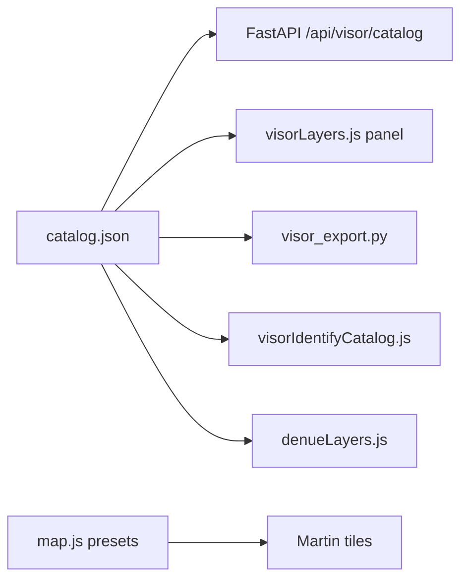

# Catálogo data-driven del Visor geográfico

Este documento describe cómo funciona el catálogo de capas del **Visor geográfico** (indicador `geo_visor`), cómo agregar o modificar capas sin tocar la lógica del explorador municipal, Datos geográficos ni Inventario de viviendas.

> **Guía práctica por tipo de geometría** (polígono, línea, punto, iconos, buscador): **[AGREGAR_CAPA.md](./AGREGAR_CAPA.md)**.

## Resumen

| Antes | Ahora |
|-------|--------|
| Lista fija en `visorLayers.js` | Panel generado desde `catalog.json` con **grupos colapsables** |
| `layer_catalog()` hardcodeado en Python | Mismo JSON vía `visor_catalog_loader.py` |
| Popup al clic: función JS por capa | Bloque `identify` en el catálogo (+ plantillas) |
| Tooltips hover + letreritos por zoom | `identify`/`tooltip` y `labels` — ver **[VISOR_LABELS_TOOLTIPS.md](./VISOR_LABELS_TOOLTIPS.md)** |
| Export KML/SHP data-driven | `data.export` + `capabilities.export` — ver **[VISOR_EXPORT.md](./VISOR_EXPORT.md)** |
| DENUE: array en `denueLayers.js` | Grupo `denue` en el catálogo |
| Buscador: SQL fijo en `geocoder.py` | Bloque `search` en el catálogo — ver **[VISOR_SEARCH.md](./VISOR_SEARCH.md)** |

**La simbología en mapa** (colores, iconos, RNC por zoom, etc.) **no se aplica solo con el catálogo**: hoy vive en `map.js`, `martinLayerStyle.js` e iconos, enlazada por `overlay_key` y `renderer`. El catálogo documenta `style_preset` como contrato; ver guía completa en **[VISOR_SYMBOLOGY.md](./VISOR_SYMBOLOGY.md)**.

## Archivo fuente de verdad

```
Stack_Martin/config/visor/catalog.json     ← edición principal (API Docker)
htdocs/atlas_gro/config/visor/catalog.json ← copia servida por Apache / import JS
```

Con Docker Compose, el volumen monta la carpeta del stack sobre `htdocs/atlas_gro/config/visor/`. Si trabaja sin Docker, mantenga **ambas rutas sincronizadas** o edite solo la de `htdocs` y copie al stack.

Variable de entorno del API (opcional):

```
VISOR_CATALOG_PATH=/config/visor/catalog.json
```

## Flujo de datos



1. **PostGIS**: tabla con geometría en esquema `atlas`.
2. **Martin**: publica la tabla (auto_publish o entrada en `martin.yaml`).
3. **catalog.json**: registra la capa (id, grupo, datos, identify, capabilities).
4. **Visor**: al entrar, `loadVisorCatalog()` → panel con grupos colapsables, export KML/SHP, popup al clic.

## Estructura del catálogo

### Grupos (`groups`)

Define el orden, los encabezados **colapsables** del panel **Capas** y qué capas incluye cada apartado:

```json
{
  "id": "marco",
  "label": "Marco geoestadístico",
  "collapsed": false,
  "collapsible": true,
  "layers": ["locspunto", "locsatlas", "colonias"]
}
```

| Campo | Descripción |
|-------|-------------|
| `id` | Identificador estable del grupo (persistencia de colapso en sesión) |
| `label` | Texto del encabezado clicable |
| `layers` | Lista ordenada de ids de capa en ese apartado |
| `collapsible` | `true` (default) — encabezado con chevron; `false` — lista plana sin botón |
| `collapsed` | `true` — inicia plegado; `false` (default) — inicia desplegado |

**Comportamiento en pantalla**

- Cada apartado con `label` se muestra como botón con chevron (▸ / ▸ rotado).
- Un clic pliega o despliega las capas del grupo **sin desactivarlas** en el mapa.
- La preferencia del usuario (plegado/desplegado) se guarda en `sessionStorage` por `id` de grupo, de modo que al cambiar de municipio o refrescar el panel se respeta su última elección.
- Si no hay estado guardado, se usa `collapsed` del catálogo.

**Ejemplo — DENUE plegado al abrir el visor** (lista larga):

```json
{
  "id": "denue",
  "label": "DENUE",
  "collapsed": true,
  "layers": ["denue_rastros", "denue_escuelas"]
}
```

### Capa (`layers.<id>`)

| Campo | Descripción |
|-------|-------------|
| `label` | Texto en el panel |
| `overlay_key` | Clave interna en `map.js` (camelCase), p. ej. `locsPunto` |
| `checkbox_id` | Id HTML del checkbox (estable para no romper estado) |
| `geometry` | `point`, `line`, `polygon` (export/backend) |
| `renderer` | Motor de mapa (ver tabla abajo) |
| `style_preset` | Nombre del preset visual (ver [VISOR_SYMBOLOGY.md](./VISOR_SYMBOLOGY.md)); hoy requiere soporte en `map.js` |
| `data` | Tabla PostGIS, filtros, columnas de export |
| `identify` | Contenido del popup al clic **y** globo al pasar el ratón |
| `tooltip` | Atajo opcional si no usa `identify` (`field`, `title`) — ver [VISOR_LABELS_TOOLTIPS.md](./VISOR_LABELS_TOOLTIPS.md) |
| `labels` | Letreritos en mapa desde `minzoom` (campo, color, placement) |
| `capabilities` | `export`, `tabular`, `spatial_analysis` |
| `identify_visor_only` | Si `true`, identify solo en visor (hidro, curvas) |

### Valores de `renderer`

| Valor | Uso |
|-------|-----|
| `overlay` | Capa estándar en `OVERLAY_DEFS` |
| `overlay_denue` | Subcapa DENUE (filtro `codigo_act`) |
| `overlay_composite` | Varias capas MapLibre (ej. RNC) |
| `visor_shared_martin` | Capa compartida con Datos geo (uso suelo, hidro) |
| `visor_shared_composite` | Compuesta visor (curvas de nivel) |

## Convenciones de datos PostGIS

### Requisitos obligatorios (resumen)

| Uso | Campos mínimos en PostGIS |
|-----|---------------------------|
| **Cualquier capa del visor** | `the_geom`, `gid`, `cve_mun` (salvo excepciones en catálogo) |
| **Capa buscable** | Lo anterior + columna de nombre (`search.name_column`) + identificador (`search.id_column`) |

Detalle completo, tablas por tipo de capa y checklist: **[VISOR_SEARCH.md — Requisitos obligatorios](./VISOR_SEARCH.md#requisitos-obligatorios)**.

- Esquema: `atlas` (o `ATLAS_SCHEMA` en `.env`).
- Tablas temáticas: prefijo `c_` recomendado (`c_mi_capa`).
- Columnas habituales:
  - `gid` — identificador entero único (**obligatorio** en el stack actual)
  - `the_geom` — geometría (**obligatoria**; SRID 3857 en el stack actual)
  - `cve_mun` — filtro municipal de 3 dígitos (**obligatorio** para filtro por municipio)
  - `cvegeo` — obligatorio en marco geoestadístico (colonias, localidades, manzanas); **no** asumir en puntos (CLUES, DENUE)
- Sin `cve_mun` válido, la capa no filtra por municipio (salvo `mun_filter_cvegeo: false` y diseño explícito).

## Bloque `identify` (popup al clic)

### Campos simples

```json
"identify": {
  "title": "Colonia",
  "fields": [
    { "column": "nom_asen" },
    { "label": "Municipio", "column": "nom_mun" }
  ]
}
```

### Unir dos columnas (tipo vialidad)

```json
"identify": {
  "title": "Vialidad",
  "join": { "left": ["tipovial"], "right": ["nomvial"] }
}
```

### Plantilla nombrada (comportamiento especial)

```json
"identify": { "template": "locs_punto" }
```

Plantillas disponibles: `locs_punto`, `locs_atlas`, `manzanas`, `vialidades`, `rnc`, `clues`, `curvas_nivel`, `denue`, `uso_suelo`, etc. (ver `visorIdentifyCatalog.js`).

### DENUE

```json
"identify": { "template": "denue", "title": "Escuelas" }
```

## Bloque `data` (backend export/buffer)

```json
"data": {
  "table": "c_loc_punto",
  "mun_filter": "cve_mun",
  "export": { "mode": "all" }
}
```

| Campo | Descripción |
|-------|-------------|
| `table` | Tabla PostGIS |
| `export` | `{ "mode": "all" }` (default) o `{ "mode": "columns", "columns": [...] }` — ver [VISOR_EXPORT.md](./VISOR_EXPORT.md) |
| `export.exclude` | Columnas a omitir cuando `mode` es `all` |
| `export_table` | Tabla para inferir columnas (si difiere de `table`) |
| `filter.codigo_act` | Lista SCIAN para capas DENUE |
| `from_sql_preset` | `rnc_simplified` — SQL predefinido para RNC |
| `mun_filter_cvegeo` | `false` si no usa filtro por CVEGEO municipal |
| `export_columns` / `export_columns_kml` | **Legacy** — use `export.mode: columns` |

## API

| Endpoint | Uso |
|----------|-----|
| `GET /api/visor/catalog` | Catálogo completo (grupos + capas) |
| `GET /api/visor/layers` | Lista plana para export (compatibilidad) |
| `GET /api/visor/export?layer=<id>` | KML/SHP según catálogo |

---

## Guía: agregar capas

### Nivel 1 — Capa simple (punto/línea/polígono estándar)

**1. Cargar SHP a PostGIS** (QGIS, `ogr2ogr`, etc.):

```bash
ogr2ogr -f PostgreSQL "PG:host=localhost dbname=atlas user=..." \
  mi_capa.shp -nln c_mi_capa -lco SCHEMA=atlas -t_srs EPSG:3857
```

Asegúrese de `gid`, `the_geom`, `cve_mun`.

**2. Martin** — con `auto_publish` en `martin.yaml` suele bastar. Tablas densas: añada bloque en `martin.yaml` con `properties` explícitas.

**3. Editar `config/visor/catalog.json`** — añada el id al grupo y la definición:

```json
"mi_capa": {
  "label": "Mi capa temática",
  "overlay_key": "miCapa",
  "checkbox_id": "visorMiCapa",
  "geometry": "point",
  "renderer": "overlay",
  "style_preset": "point_default",
  "data": {
    "table": "c_mi_capa",
    "mun_filter": "cve_mun"
  },
  "identify": {
    "title": "Mi capa",
    "fields": [{ "column": "nombre" }]
  },
  "capabilities": {
    "export": ["kml", "shp"],
    "tabular": false,
    "spatial_analysis": true
  }
}
```

**4. Simbología en mapa** — ver **[VISOR_SYMBOLOGY.md](./VISOR_SYMBOLOGY.md)** (niveles 1–5). Resumen:
- Preset existente → `OVERLAY_DEFS` + `visorLayerBindings.js` + leyenda.
- DENUE → bloque `style` en catálogo + icono en `mapDenueIcons.js`.
- Compuesta (RNC, curvas) → extensión en `map.js` (una vez por patrón).

**5. Sincronizar** copia en `htdocs/atlas_gro/config/visor/` si no usa Docker.

**6. Recargar** visor (Ctrl+Shift+R) y reiniciar API si hace falta.

---

### Nivel 2 — Capa DENUE (filtro por actividad)

Misma tabla `c_denue`, distinto `codigo_act`:

```json
"denue_farmacias": {
  "label": "Farmacias",
  "overlay_key": "denueFarmacias",
  "checkbox_id": "visorDenueFarmacias",
  "geometry": "point",
  "renderer": "overlay_denue",
  "data": {
    "table": "c_denue",
    "filter": { "codigo_act": [464112] },
    "gid_table": "c_denue",
    "mun_filter_cvegeo": false,
    "shp_all_table_columns": true,
    "export_columns_kml": ["gid", "cve_mun", "municipio", "codigo_act", "nom_estab", "nombre_act", "localidad"]
  },
  "style": {
    "icon_key": "denueFarmacias",
    "label_color": "#1565c0",
    "tip_title": "Farmacias"
  },
  "identify": { "template": "denue", "title": "Farmacias" },
  "capabilities": { "export": ["kml", "shp"], "tabular": true, "spatial_analysis": true }
}
```

Además:

- Icono en `mapDenueIcons.js` (`DENUE_SYMBOL_LAYOUT_BY_KEY`, sprite).
- Entrada en grupo `denue` en `groups`.
- Si `tabular: true`, opcionalmente `tabular.preset` o `tabular.columns` en el catálogo.

`denueLayers.js` lee el grupo DENUE del JSON al cargar el módulo.

---

### Nivel 3 — Consulta tabular

Con `"capabilities": { "tabular": true }` la capa aparece en el selector sin editar listas fijas en Python.

Bloque opcional `tabular` en la capa:

| Clave | Uso |
|-------|-----|
| `preset` | `locspunto`, `clues` o `denue` (columnas legacy) |
| `columns` | `[{ "field", "label", "candidates"? }]` para consultas genéricas |

`app_api/visor_tabular.py` lee el catálogo vía `capabilities.tabular` y `tabular.*`.

---

### Análisis espacial

| Fuente | Contenido |
|--------|-----------|
| `config/visor/analysis_catalog.json` | INV / ITER (secciones de indicadores) |
| `catalog.json` + `capabilities.spatial_analysis` | DENUE y CLUES |

El API expone `analysis_catalog` en `GET /api/visor/catalog`.

---

### Leyenda

Bloque opcional `legend` por capa:

```json
"legend": {
  "items": [{ "kind": "line", "color": "#990000", "label": "AGEB urbana" }]
}
```

Si no hay `legend`, capas con preset genérico usan `visorLegendRegistry.js` + `style` del catálogo.

---

### Nivel 4 — Estilo compuesto (RNC, curvas)

Use `renderer` y `style_preset` existentes:

- `overlay_composite` + `rnc_tiered`
- `visor_shared_composite` + `curvas_nivel`

No basta con JSON: la lógica multi-capa vive en `map.js`. El catálogo **declara** que la capa usa ese preset.

---

## Archivos del proyecto (referencia)

| Archivo | Rol |
|---------|-----|
| `config/visor/catalog.json` | Catálogo (editar aquí) |
| `app_api/visor_catalog_loader.py` | Carga JSON → `layer_catalog()` |
| `app_api/visor_layers.py` | Fachada export/buffer |
| `htdocs/atlas_gro/js/visorCatalog.js` | Fetch y cache frontend |
| `htdocs/atlas_gro/js/visorLayers.js` | Panel dinámico |
| `htdocs/atlas_gro/js/visorLayerBindings.js` | id → get/set mapa |
| `htdocs/atlas_gro/js/visorIdentifyCatalog.js` | Popup desde `identify` |
| `htdocs/atlas_gro/js/denueLayers.js` | OVERLAY DENUE desde JSON |
| `htdocs/atlas_gro/js/map.js` | Estilos y activación |
| `martin.yaml` | Tiles vectoriales |
| **`docs/VISOR_SYMBOLOGY.md`** | **Arquitectura y guía de simbología** |

## Qué NO cambia este catálogo

- Explorador municipal (sin panel de capas temáticas).
- Módulo **Datos geográficos** (`geoContext`) — relieve, clima por pestaña.
- **Inventario de viviendas** (`invViv`) — capas `invviv-*`.
- Comparador de mapas base, geocoder, dibujo, buffer (siguen usando el mismo mapa).

## Comprobación rápida

1. `GET /api/visor/catalog` → `ok: true`, 23 capas, 5 grupos.
2. Visor geográfico → panel con encabezados de grupo **colapsables** (chevron).
3. Activar capa → se ve en mapa (aunque el grupo esté plegado).
4. Clic → popup según `identify`.
5. KML/SHP → descarga sin error.

## Solución de problemas

| Síntoma | Revisar |
|---------|---------|
| Panel vacío / error rojo | `catalog.json` válido, ruta montada, consola `[visor]` |
| Capa en panel pero no en mapa | `overlay_key`, `OVERLAY_DEFS`, Martin — ver [VISOR_SYMBOLOGY.md](./VISOR_SYMBOLOGY.md) |
| Estilo incorrecto / capa invisible | `style_preset`, `renderer`, `martin.yaml` properties |
| Export falla | `data.table`, `gid`, API `layer_config` |
| Popup vacío | `identify`, columnas en MVT (`martin.yaml` properties) |
| DENUE sin icono | `mapDenueIcons.js`, `style.icon_key` |

---

*Última actualización: implementación inicial del catálogo data-driven (visor geográfico únicamente).*
