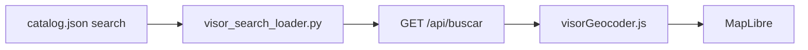

# Buscador geográfico data-driven (Visor)

Guía del **buscador offline** del Visor geográfico: cómo declarar nuevas fuentes de búsqueda en el catálogo sin modificar SQL ni JavaScript.

**Alcance:** solo el **Visor geográfico** (`geo_visor`). No aplica al explorador municipal, Datos geográficos ni Inventario de viviendas.

**Documentos relacionados:** [VISOR_CATALOG.md](./VISOR_CATALOG.md) (alta de capas), [VISOR_SYMBOLOGY.md](./VISOR_SYMBOLOGY.md) (pintura en mapa).

---

## Respuesta directa

| Pregunta | Respuesta |
|----------|-----------|
| ¿Se puede hacer data-driven? | **Sí.** Las fuentes del buscador se declaran en `catalog.json` con un bloque `search` por capa (o `search_extras` para tablas sin capa en el panel). |
| ¿Qué hace falta para una capa nueva? | PostGIS + Martin + entrada en catálogo con `search.enabled: true` y columnas a buscar. **No** hace falta tocar `geocoder.py` ni `visorGeocoder.js`. |
| ¿Qué ve el usuario? | Autocompletado al escribir (mín. 2 caracteres), tipo de elemento, ficha con coordenadas, pin o contorno en mapa y acercamiento automático. |
| ¿Hay campos obligatorios en PostGIS? | **Sí**, pero dependen del uso: capa en mapa vs. capa **buscable**. Ver [Requisitos obligatorios](#requisitos-obligatorios) más abajo. |

---

## Requisitos obligatorios

Use esta sección como **checklist para quien carga datos**. No todo campo aplica a toda capa; lo importante es distinguir **capa en el visor** vs. **capa en el buscador**.

### A. Toda capa temática del visor (mapa, panel, export)

Estos campos en PostGIS son **obligatorios** para que la capa funcione bien en el stack actual:

| Campo | ¿Obligatorio? | Para qué |
|-------|---------------|----------|
| `the_geom` | **Sí** | Geometría en el mapa (Martin MVT), export, identify |
| `gid` | **Sí** | Identificar filas en export, identify preciso, muchas capas de puntos |
| `cve_mun` | **Sí** (salvo excepciones) | Filtrar por municipio seleccionado en el visor. Valor de **3 dígitos** (`001`, `012`…) |

**Excepciones habituales a `cve_mun`:**

| Caso | Qué hacer en catálogo |
|------|------------------------|
| Capa estatal sin corte municipal (ej. uso de suelo) | `data.mun_filter_cvegeo: false` y lógica propia en mapa |
| DENUE (`c_denue`) | `data.mun_filter_cvegeo: false`; la tabla usa `cve_mun` directo |
| Municipios (`c_mun`) | No es capa del panel; va en `search_extras` si se busca |

**Martin:** las columnas usadas en identify, export o filtros deben estar publicadas en el MVT (`martin.yaml` o `auto_publish`).

---

### B. Capa buscable (`search.enabled: true`)

Además de lo anterior, para que aparezca en el **buscador** hace falta:

#### En PostGIS (obligatorio)

| Campo | ¿Obligatorio? | Notas |
|-------|---------------|-------|
| `the_geom` | **Sí** | Con geometría **válida** y transformable a WGS84. Filas con `the_geom` nulo no salen en resultados |
| Columna de nombre (`name_column`) | **Sí** | Texto que verá el usuario (ej. `nom_asen`, `nom_loc`, `nom_estab`). Debe existir en la tabla |
| Columna identificadora (`id_column`) | **Sí** | Debe **identificar la fila** al recuperar geometría. Ver tabla por tipo abajo |
| `cve_mun` | **Sí** si `scope` es `municipio` o `both` y `mun_filter: true` | Sin esto, la búsqueda municipal no acota bien o no devuelve nada |

#### En `catalog.json` (obligatorio)

| Campo | ¿Obligatorio? | Notas |
|-------|---------------|-------|
| `search.enabled` | **Sí** | `true` |
| `search.name_column` | **Sí** | Nombre de columna en PostGIS |
| `data.table` | **Sí** | Tabla publicada en Martin |
| `search.id_column` | **Recomendado** | Si se omite, default `cvegeo` — **incorrecto** en puntos sin `cvegeo` |
| `search.geom_mode` | **Recomendado** | Debe coincidir con la geometría real (`point` / `polygon`) |

#### Elegir `id_column` según el tipo de capa

| Tipo de elemento | Geometría | `id_column` típico | ¿Necesita `cvegeo`? | `mun_filter_cvegeo` |
|------------------|-----------|--------------------|----------------------|------------------------|
| Localidad, colonia, AGEB, manzana | Polígono / línea | `cvegeo` | Sí (marco geoestadístico) | `true` (default) |
| Municipio (`search_extras`) | Polígono | `cve_mun` | No | N/A (`mun_filter: false`) |
| CLUES, residuos, puntos propios | Punto | `gid` | **No** | **`false`** |
| DENUE (cada subcapa) | Punto | `gid` | **No** | **`false`** + `mun_filter: true` |

> **Regla práctica:** si la tabla **no tiene** columna `cvegeo`, declare siempre en el bloque `search`:
> ```json
> "mun_filter": true,
> "mun_filter_cvegeo": false
> ```
> Omitir esto puede romper la búsqueda de **otras** capas (error SQL) o mostrar resultados de todo el estado.

#### Columnas opcionales pero útiles

| Campo | Uso |
|-------|-----|
| `search.search_columns` | Buscar también por alias (ej. `clues`, `nom_insti` además de `nom_comer`) |
| `search.tipo` | Etiqueta en el autocompletado («Colonia», «Escuela»…) |
| `search.scope` | `both` \| `municipio` \| `estatal` — cuándo aparece la fuente |

---

### C. Checklist rápido antes de publicar

**Solo capa en mapa (sin buscador):**

- [ ] `the_geom`, `gid`, `cve_mun` (o excepción documentada en catálogo)
- [ ] Tabla en Martin
- [ ] Entrada en `catalog.json` con `data.table`, `identify`, `renderer`

**Capa también buscable:**

- [ ] Todo lo anterior
- [ ] `name_column` existe y tiene texto representativo
- [ ] `id_column` correcto (`cvegeo` vs `gid`)
- [ ] `geom_mode` coherente con geometría
- [ ] `mun_filter` / `mun_filter_cvegeo` correctos si aplica filtro municipal
- [ ] DENUE: `data.filter.codigo_act` ya definido en la capa
- [ ] Probar en visor: escribir 2+ caracteres con municipio seleccionado
- [ ] Probar selección: pin o contorno + acercamiento al mapa

---

### D. Qué pasa si falta algo

| Falta | Efecto |
|-------|--------|
| `the_geom` nulo | La fila no aparece en búsqueda |
| `name_column` inexistente | Esa fuente falla (las demás siguen si están bien configuradas) |
| `id_column` incorrecto | Aparece en lista pero no resalta / no encuadra al seleccionar |
| `cve_mun` vacío con filtro municipal | No sale en búsqueda municipal o sale en municipio equivocado |
| `mun_filter_cvegeo: true` sin columna `cvegeo` | Error SQL en esa fuente (antes podía tumbar todo el buscador) |
| Sin bloque `search` | La capa **no** es buscable; el resto del visor puede funcionar igual |

**No es obligatorio** que toda capa del visor sea buscable. Solo las que tengan `search.enabled: true` (o entradas en `search_extras`) participan en el buscador.

---

## Arquitectura



1. **`catalog.json`** — define qué tablas/columnas son buscables (`search` por capa + `search_extras`).
2. **`visor_search_loader.py`** — lee el catálogo y arma el `UNION ALL` SQL en tiempo de ejecución.
3. **`geocoder.py`** — ejecuta la búsqueda y devuelve filas normalizadas (`nombre_busqueda`, `tipo`, `tabla_origen`, `id_origen`, `geom_tipo`, `lng`, `lat`).
4. **`visorGeocoder.js`** — MaplibreGeocoder + `/api/buscar` + resaltado de polígonos vía `/api/buscar/geometria`.
5. **`visorSearchCatalog.js`** — placeholder dinámico (“Buscar Localidad, Colonia… en Acapulco…”).

---

## Comportamiento según ámbito

| Modo visor | `cve_mun` en API | Fuentes incluidas |
|------------|------------------|-------------------|
| **Estatal** (todo Guerrero) | vacío | `scope: estatal` y `scope: both` |
| **Municipal** | clave 3 dígitos | `scope: municipio` y `scope: both` (con filtro municipal si `mun_filter: true`) |

Fuentes con `scope: municipio` **no** aparecen en búsqueda estatal (ej. CLUES, DENUE escuelas).

La entrada especial `search_extras` para **`c_mun`** (municipios) solo se usa en modo estatal.

---

## Declaración en el catálogo

### Bloque raíz (opcional)

```json
"search": {
  "limit_per_source": 5
}
```

| Campo | Descripción |
|-------|-------------|
| `limit_per_source` | Máximo de coincidencias **por fuente** en cada búsqueda (1–20, default 5). |

### Fuentes sin capa en el panel (`search_extras`)

Para tablas que no son capa temática del visor (ej. municipios):

```json
"search_extras": [
  {
    "id": "mun",
    "enabled": true,
    "table": "c_mun",
    "tipo": "Municipio",
    "name_column": "nomgeo",
    "id_column": "cve_mun",
    "geom_mode": "polygon",
    "scope": "estatal",
    "mun_filter": false
  }
]
```

### Bloque `search` en una capa

Añadir dentro de la entrada de capa en `layers`:

```json
"search": {
  "enabled": true,
  "tipo": "Colonia/Asentamiento",
  "name_column": "nom_asen",
  "id_column": "cvegeo",
  "geom_mode": "polygon",
  "scope": "both"
}
```

| Campo | Obligatorio | Descripción |
|-------|-------------|-------------|
| `enabled` | sí | `true` para indexar la capa en el buscador |
| `name_column` | sí | Columna principal mostrada en resultados |
| `search_columns` | no | Lista de columnas con `ILIKE` (OR). Default: `[name_column]` |
| `id_column` | no | Identificador para geometría (`cvegeo`, `gid`, `cve_mun`…). Default: `cvegeo` |
| `tipo` | no | Etiqueta en autocompletado. Default: `label` de la capa |
| `geom_mode` | no | `point` \| `centroid` \| `polygon` — cómo obtener lng/lat y si se dibuja contorno |
| `scope` | no | `both` (default) \| `estatal` \| `municipio` |
| `mun_filter` | no | Si aplica filtro municipal con `cve_mun`. Default: según `data.mun_filter` |
| `mun_filter_cvegeo` | no | `true` (default) usa `cvegeo` además de `cve_mun` en el filtro. **`false`** para tablas sin `cvegeo` (CLUES, DENUE) |
| `highlight` | no | Si al seleccionar se pide geometría a `/api/buscar/geometria`. Default: `true` |

**`geom_mode`**

| Valor | Coordenadas de búsqueda | Al seleccionar |
|-------|-------------------------|----------------|
| `point` | Centroide del punto (`the_geom`) | Pin en el mapa |
| `centroid` / `polygon` | Centroide del polígono | Contorno resaltado + encuadre |

---

## Fuentes activas hoy (referencia)

| Origen | Tabla | Tipo mostrado | Ámbito |
|--------|-------|---------------|--------|
| `search_extras` | `c_mun` | Municipio | estatal |
| `locspunto` | `c_loc_punto` | Localidad | both |
| `locsatlas` | `c_l` | Localidad con amanzanamiento | both |
| `colonias` | `c_col_ase` | Colonia/Asentamiento | both |
| `clues` | `c_clues` | Establecimiento de salud | municipio |
| `denue_escuelas` | `c_denue` | Escuela | municipio |

Otras capas pueden activarse añadiendo su bloque `search` (ver guía abajo).

---

## Guía paso a paso: nueva fuente de búsqueda

### Ejemplo — buscar gasolineras DENUE por nombre

**Requisitos:** la capa `denue_gasolinerias` ya existe en catálogo y Martin publica `c_denue`.

1. **Verificar columnas** en PostGIS (`nom_estab`, `gid`, `codigo_act`, `the_geom`, `cve_mun`).

2. **Editar** `config/visor/catalog.json` — en la entrada `denue_gasolinerias`, añadir:

```json
"search": {
  "enabled": true,
  "tipo": "Gasolinera",
  "name_column": "nom_estab",
  "search_columns": ["nom_estab", "nombre_act", "localidad"],
  "id_column": "gid",
  "geom_mode": "point",
  "scope": "municipio",
  "mun_filter": true,
  "mun_filter_cvegeo": false
}
```

El filtro `data.filter.codigo_act` de la capa se aplica **automáticamente** en la búsqueda. Ver [requisitos obligatorios](./VISOR_SEARCH.md#requisitos-obligatorios) si la tabla no tiene `cvegeo`.

3. **Sincronizar** copia en `htdocs/atlas_gro/config/visor/catalog.json` (o volumen Docker).

4. **Reiniciar** el API FastAPI si está en caché (el loader usa `@lru_cache`).

5. **Probar en el visor:**
   - Seleccionar municipio con gasolineras.
   - Escribir al menos 2 caracteres en el buscador.
   - Elegir resultado → pin, ficha y acercamiento.

6. **Consola:** no debe haber errores `[visor geocoder]`.

### Ejemplo — capa nueva simple (puntos de interés)

1. Tabla `atlas.c_mirador` con `gid`, `nombre`, `cve_mun`, `the_geom` (Point).

2. Martin publica la tabla.

3. Entrada de capa en catálogo (ver VISOR_CATALOG.md) **más**:

```json
"search": {
  "enabled": true,
  "tipo": "Mirador",
  "name_column": "nombre",
  "id_column": "gid",
  "geom_mode": "point",
  "scope": "municipio",
  "mun_filter": true,
  "mun_filter_cvegeo": false
}
```

4. Sincronizar JSON y recargar visor.

No requiere cambios en `geocoder.py` ni `visorGeocoder.js`.

---

## Checklist al agregar búsqueda

- [ ] Columnas en `search_columns` existen en PostGIS y en MVT (si aplica identify).
- [ ] `id_column` identifica la fila de forma única para `/api/buscar/geometria`.
- [ ] `geom_mode` coherente con geometría real de la tabla.
- [ ] `scope` correcto (¿debe buscarse solo con municipio seleccionado?).
- [ ] Para DENUE: la capa ya tiene `data.filter.codigo_act`.
- [ ] Placeholder del buscador menciona el nuevo tipo tras recargar.
- [ ] Prueba: autocompletado, selección, pin/contorno, ficha de coordenadas.

---

## API

### `GET /api/buscar`

| Parámetro | Descripción |
|-----------|-------------|
| `q` | Texto (mín. 2 caracteres) |
| `cve_mun` | Opcional. Clave municipal 3 dígitos |

Respuesta: `{ ok, query, count, rows: [{ nombre_busqueda, tipo, tabla_origen, id_origen, geom_tipo, lng, lat }] }`.

### `GET /api/buscar/geometria`

| Parámetro | Descripción |
|-----------|-------------|
| `tabla` | Nombre de tabla (`c_col_ase`, `c_clues`, …) |
| `cvegeo` | Valor de `id_column` del resultado |

Solo tablas declaradas en el catálogo con `highlight` no explícitamente `false`.

### `GET /api/visor/search`

Lista de fuentes activas (derivada del catálogo). También incluida en `GET /api/visor/catalog` → `search`.

---

## Archivos de referencia

| Archivo | Rol |
|---------|-----|
| `config/visor/catalog.json` | `search`, `search_extras`, bloque `search` por capa |
| `app_api/visor_search_loader.py` | Índice y SQL dinámico |
| `app_api/geocoder.py` | Ejecución búsqueda y geometría |
| `app_api/routers/api.py` | Endpoints `/api/buscar`, `/api/visor/search` |
| `js/visorGeocoder.js` | UI buscador + mapa |
| `js/visorSearchCatalog.js` | Placeholder y fuentes en frontend |
| `js/geocoderApi.js` | Cliente HTTP |

---

## Limitaciones actuales

- Búsqueda por **texto parcial** (`ILIKE %término%`), no fonética ni ranking avanzado.
- No activa automáticamente la capa temática en el panel al seleccionar un resultado (solo navega en el mapa).
- Capas sin bloque `search` o con `enabled: false` no participan.
- El loader del API cachea el índice; tras editar `catalog.json` en producción, **reinicia FastAPI** (`docker restart fastapi_backend`).
- Cada fuente se consulta por separado: si una capa tiene SQL inválido, las demás siguen funcionando (revisar logs del API).

---

*Documento operativo del buscador data-driven del visor geográfico.*
