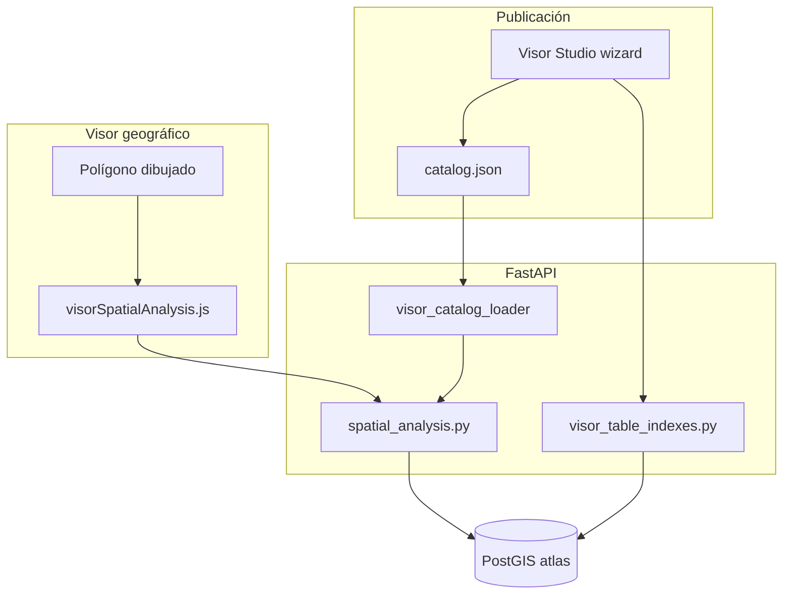

# Análisis espacial del Visor geográfico

Guía del módulo de **análisis espacial** en el Visor geográfico: dibujar un polígono, elegir capa e indicadores, obtener conteos o agregaciones y (opcionalmente) tabla detalle. Incluye la configuración desde **Visor Studio**, el bloque `spatial_analysis` en el catálogo y la gestión de **índices PostgreSQL** en caliente.

**Documentos relacionados:**

| Documento | Para qué |
|-----------|----------|
| [VISOR_CATALOG.md](./VISOR_CATALOG.md) | Estructura general del catálogo |
| [VISOR_STUDIO.md](./VISOR_STUDIO.md) | Asistente de publicación y panel de índices |
| [AGREGAR_CAPA.md](./AGREGAR_CAPA.md) | Carga de datos y edición manual del JSON |

---

## Resumen

| Antes | Ahora |
|-------|--------|
| Capas fijas en Python (`CAPAS_ANALISIS` hardcodeado) | Catálogo data-driven: `catalog.json` + `analysis_catalog.json` |
| Solo INV/ITER, DENUE y CLUES | Cualquier capa publicada desde Visor Studio con bloque `spatial_analysis` |
| Sin feedback al ejecutar consulta lenta | Spinner, panel de carga y bloqueo de doble clic |
| Índices solo como SQL en documentación | Panel en paso **Revisión** del wizard: ver existentes y crear faltantes vía API |

---

## Flujo en el visor (usuario final)

1. Abrir **Visor geográfico** y activar la herramienta de dibujo de polígono.
2. Dibujar y cerrar un polígono en el mapa.
3. Pulsar el botón **Análisis espacial** (aparece cuando hay polígono válido).
4. En el modal:
   - Elegir **capa a analizar** (agrupada: censales, salud, DENUE, capas configuradas, etc.).
   - Si la capa es de **agregación**, marcar indicadores numéricos.
   - Pulsar **Ejecutar consulta**.
5. Revisar resultados (conteo, sumas/promedios, tabla detalle) y exportar a Excel si aplica.

### Feedback durante la consulta

En tablas grandes **sin índice GIST** en `the_geom`, la consulta puede tardar varios segundos. La UI indica explícitamente que está trabajando:

- Botón con spinner y texto «Consultando…»
- Mensaje de estado «Ejecutando consulta espacial…»
- Panel de resultados con aviso de espera
- Un solo clic a la vez (`_analysisRunning` evita consultas duplicadas)

Si parece que «no pasa nada», compruebe el panel de carga y considere crear el índice espacial (ver [Índices PostgreSQL](#índices-postgresql-rendimiento-y-wizard)).

---

## Fuentes de capas para el análisis

El backend fusiona dos orígenes en `merge_capas_analisis()` (`app_api/visor_catalog_loader.py`):

| Fuente | Archivo | Capas típicas |
|--------|---------|----------------|
| Catálogo de análisis legacy | `config/visor/analysis_catalog.json` | INV (`c_inv`), ITER (`iter`) — secciones de indicadores censales |
| Catálogo principal del visor | `config/visor/catalog.json` | DENUE, CLUES, capas Studio con bloque `spatial_analysis` |

Tras publicar o editar una capa en Visor Studio, el API invalida la caché y recarga `CAPAS_ANALISIS` (`refresh_capas_analisis()` en `spatial_analysis.py`).

### Reglas de elegibilidad

No basta con `"capabilities": { "spatial_analysis": true }` en todas las capas:

| Tipo de capa | Condición para aparecer en el análisis |
|--------------|----------------------------------------|
| **DENUE** (`c_denue` + `data.filter.codigo_act`) | Legacy: solo el flag `spatial_analysis` |
| **CLUES** | Legacy: solo el flag |
| **Capas Visor Studio** | Flag **y** bloque `spatial_analysis` completo publicado por el wizard |
| Modo **conteo** | Bloque con `modo: "conteo"` |
| Modo **agregación** | Bloque con `sections[].campos` con al menos un indicador |

Capas con `spatial_analysis: true` pero **sin** bloque wizard (p. ej. colonias, manzanas legacy) **no** se listan en el picker — evita confusión con flags heredados.

---

## Bloque `spatial_analysis` en el catálogo

Además de `capabilities.spatial_analysis`, las capas Studio llevan un objeto `spatial_analysis`:

```json
{
  "id": "regiones",
  "label": "Regiones",
  "geometry": "polygon",
  "capabilities": {
    "spatial_analysis": true
  },
  "data": {
    "table": "c_regiones",
    "mun_filter": false
  },
  "spatial_analysis": {
    "modo": "conteo",
    "geom_column": "the_geom",
    "grupo": "tematicas",
    "detail_table": true,
    "detail_columns": [
      { "columna": "nomgeo", "etiqueta": "Nombre" },
      { "columna": "region", "etiqueta": "Región" }
    ],
    "ui": {
      "unidad_registro": "Regiones",
      "empty_msg": "No hay regiones dentro del polígono."
    }
  }
}
```

### Campos del bloque

| Campo | Descripción |
|-------|-------------|
| `modo` | `conteo` (puntos/polígonos contados) o `agregacion` (suma/promedio de columnas numéricas) |
| `geom_column` | Columna PostGIS (por defecto `the_geom`) |
| `grupo` | Agrupación en el picker del visor: `tematicas`, `salud`, `denue`, `censales`, `otros` |
| `sections` | Solo en agregación: `[{ "titulo": "Indicadores", "campos": [{ "columna", "etiqueta", "agregacion": "sum"\|"avg" }] }]` |
| `detail_table` | Si `true`, devuelve filas detalle de elementos intersectados |
| `detail_columns` | Columnas visibles en la tabla detalle |
| `ui.unidad_registro` | Texto en resultados («12 Regiones») |
| `ui.empty_msg` | Mensaje cuando el conteo es cero |

### Modo por geometría (convención del wizard)

| `geometry` | Modo por defecto en Visor Studio |
|------------|----------------------------------|
| `point` | `conteo` |
| `line`, `polygon` | `agregacion` (salvo que el operador elija conteo) |

DENUE en el wizard siempre usa `conteo`.

---

## Configuración desde Visor Studio

En el paso **Identificación** del asistente:

1. Activar **Incluir en análisis espacial**.
2. Elegir **Conteo** o **Agregación**.
3. En agregación: seleccionar columnas numéricas y tipo suma/promedio.
4. Opcional: **Tabla detalle** y columnas a mostrar.
5. Opcional: unidad de registro y mensaje si no hay resultados.

Al publicar, el API valida el bloque (`visor_catalog_validate.py`) y lo persiste en `catalog.json`.

### Paso Revisión — índices PostgreSQL

Panel desplegable **«Índices PostgreSQL (informativo)»**:

- Consulta en vivo qué índices **ya existen** en la tabla.
- Compara con las **sugerencias** según la configuración (geom, `cve_mun`, filtros, búsqueda, análisis, etc.).
- Permite **crear índices faltantes** uno a uno o todos de golpe (solo administradores).
- Muestra el SQL sugerido como referencia.

Requiere sesión admin y API actualizado. Tras cambios en el backend:

```bash
docker compose restart api_backend
```

---

## API de análisis espacial

Rutas públicas del visor (sin JWT; el visor las consume con `spatialAnalysisApi.js`):

| Método | Ruta | Descripción |
|--------|------|-------------|
| GET | `/api/analisis/capas` | Lista capas habilitadas para el picker |
| POST | `/api/analisis/capas-intersectantes` | Capas INV/ITER con registros dentro del polígono |
| GET | `/api/capas/{tabla}/columnas` | Columnas numéricas para agregación |
| POST | `/api/analisis/dinamico` | Ejecuta intersección + conteo/agregación |

### Cuerpo `POST /api/analisis/dinamico`

```json
{
  "tabla": "regiones",
  "campos_elegidos": ["pob_total"],
  "geojson": { "type": "Feature", "geometry": { "type": "Polygon", "coordinates": [] } },
  "cve_mun": "012"
}
```

- `tabla`: id de capa en `CAPAS_ANALISIS` (no necesariamente el nombre físico de la tabla PostGIS).
- `campos_elegidos`: vacío en modo conteo.
- `cve_mun`: filtro municipal opcional (3 dígitos).

---

## API admin — índices en caliente

Rutas bajo `/api/visor/admin` (requieren JWT de administrador):

| Método | Ruta | Descripción |
|--------|------|-------------|
| GET | `/tables/{tabla}/indexes` | Índices existentes en PostGIS |
| POST | `/tables/{tabla}/indexes/plan` | Plan de sugerencias según payload de capa |
| POST | `/tables/{tabla}/indexes` | Crear índices (`CREATE INDEX IF NOT EXISTS`) |

### Seguridad

- Solo tablas presentes en **Martin** o ya en el **catálogo**.
- Solo sentencias `CREATE INDEX` con columnas y métodos validados (`gist` | `btree`).
- No se acepta SQL arbitrario del cliente.

### Índices sugeridos (lógica)

| Configuración de la capa | Índice sugerido |
|--------------------------|-----------------|
| Siempre | GIST en `the_geom` |
| Alcance municipal (`mun_filter: cve_mun`) | btree en `cve_mun` |
| Filtro de atributo | btree en columna del filtro |
| Estilo por atributo | btree en columna de estilo |
| Buscador | btree en columnas de búsqueda |
| Etiquetas | btree en columna de etiqueta |
| DENUE | btree en `codigo_act` |
| Análisis agregación / detalle | btree en columnas indicadas |
| Exportación con columnas explícitas | btree en esas columnas |

La detección compara **columna y tipo de índice** (GIST vs btree), no el nombre sugerido. Si al importar un shapefile PostGIS creó `c_mi_capa_the_geom_geom_idx`, el wizard lo marcará como **Existe** aunque el SQL sugerido diga `idx_c_mi_capa_the_geom_gist`.

### Crear índices manualmente (alternativa)

```sql
CREATE INDEX IF NOT EXISTS idx_c_mi_capa_the_geom_gist
  ON atlas.c_mi_capa USING GIST (the_geom);

CREATE INDEX IF NOT EXISTS idx_c_mi_capa_cve_mun
  ON atlas.c_mi_capa (cve_mun);
```

En tablas muy grandes, `CREATE INDEX` puede bloquear la tabla durante la creación. El panel del wizard espera la respuesta HTTP; si tarda mucho, ejecute el SQL en `psql` y pulse **Actualizar** en el panel.

---

## Índices PostgreSQL: rendimiento y wizard

El índice **más importante** para el análisis espacial es **GIST en `the_geom`**. Sin él, cada consulta hace secuencia espacial completa y la UI puede parecer «congelada» aunque esté trabajando.

Orden recomendado al publicar una capa nueva con análisis:

1. Publicar la capa en Visor Studio.
2. En **Revisión**, abrir el panel de índices y crear el GIST en `the_geom`.
3. Crear `cve_mun` si la capa es municipal.
4. **Ctrl+F5** en el visor y probar el análisis.

---

## Archivos del proyecto

| Archivo | Rol |
|---------|-----|
| `config/visor/catalog.json` | Bloque `spatial_analysis` por capa |
| `config/visor/analysis_catalog.json` | INV / ITER (legacy) |
| `app_api/spatial_analysis.py` | Motor PostGIS: intersección, agregación, detalle |
| `app_api/visor_catalog_loader.py` | `merge_capas_analisis()`, elegibilidad Studio |
| `app_api/visor_table_indexes.py` | Plan y creación segura de índices |
| `app_api/routers/api.py` | Endpoints `/api/analisis/*` |
| `app_api/routers/visor_admin.py` | Endpoints admin de índices |
| `htdocs/atlas_gro/js/visorSpatialAnalysis.js` | Modal, picker, consulta, export Excel |
| `htdocs/atlas_gro/js/spatialAnalysisApi.js` | Cliente HTTP del análisis |
| `htdocs/atlas_gro/js/visorCatalogAdmin.js` | Wizard: toggle análisis + panel índices |

---

## Flujo de datos (diagrama)



---

## Solución de problemas

| Síntoma | Causa probable | Acción |
|---------|----------------|--------|
| La capa no aparece en el picker | Falta bloque `spatial_analysis` o modo agregación sin indicadores | Republicar desde Visor Studio con análisis configurado |
| Capa en grupo equivocado del picker | `spatial_analysis.grupo` | Usar `tematicas` para capas Studio genéricas |
| «No pasa nada» al ejecutar | Consulta lenta sin índice GIST | Crear índice en `the_geom`; esperar feedback de carga |
| 404 en `/api/analisis/*` | API desactualizado | `docker compose restart api_backend` |
| Panel índices falla | Tabla no en Martin ni catálogo | Reiniciar Martin si la tabla es nueva |
| Resultados vacíos con polígono correcto | Filtro `cve_mun` / geometría SRID | Verificar SRID 3857 y municipio activo en el visor |
| Cambios en catálogo no se reflejan | Caché del loader | Reiniciar `api_backend` o guardar capa vía Studio (invalida caché) |

---

## Edición manual del catálogo (sin Studio)

Si edita `catalog.json` a mano:

1. Ponga `"spatial_analysis": true` en `capabilities`.
2. Añada el bloque `spatial_analysis` completo (no solo el flag).
3. Reinicie o guarde vía API para refrescar `CAPAS_ANALISIS`.
4. **Ctrl+F5** en el visor.

Ejemplo mínimo agregación:

```json
"capabilities": { "spatial_analysis": true },
"spatial_analysis": {
  "modo": "agregacion",
  "geom_column": "the_geom",
  "grupo": "tematicas",
  "sections": [
    {
      "titulo": "Indicadores",
      "campos": [
        { "columna": "area_ha", "etiqueta": "Área (ha)", "agregacion": "sum" }
      ]
    }
  ]
}
```

Para el detalle de publicación asistida, use [VISOR_STUDIO.md](./VISOR_STUDIO.md).
