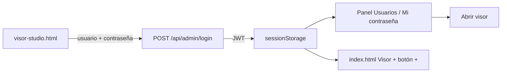

# Visor Studio — acceso y cuentas de administrador

Guía del **login**, la **sesión JWT** y la **gestión de usuarios** del Visor geográfico. Complementa [VISOR_STUDIO.md](./VISOR_STUDIO.md) (publicación de capas) y [SEGURIDAD.md](./SEGURIDAD.md) (medidas del stack).

---

## Resumen

| Función | Dónde |
|---------|--------|
| Iniciar sesión | `visor-studio.html` |
| Gestionar usuarios | Misma página, pestaña **Usuarios** (tras login) |
| Cambiar mi contraseña | Pestaña **Mi contraseña** |
| Publicar capas | Visor geográfico → botón **+** (con sesión activa) |
| Cerrar sesión | Visor Studio o borrar sesión del navegador |

**URL (ajuste el puerto según `PORT_NGINX`):**

`http://localhost:850/atlas_gro/visor-studio.html`

No hay enlace en el menú público. Guarde la URL en favoritos.

---

## Flujo de acceso



1. El administrador abre `visor-studio.html`.
2. Envía credenciales a `POST /api/admin/login`.
3. Si son válidas, el API devuelve un **token JWT** y datos del usuario.
4. El front guarda el token en `sessionStorage` (`atlasVisorAdminToken`).
5. Puede gestionar cuentas en la misma página o pulsar **Abrir visor** para publicar capas.
6. El visor detecta la sesión y muestra los botones **+** (publicar) y **Gestionar**.

---

## Requisitos previos (primera vez)

### 1. Esquema SQL

Tabla `atlas_admin.users` (ver `app_api/docs/sql/atlas_admin_schema.sql`).

### 2. Variables en `.env`

```env
JWT_SECRET=<cadena larga aleatoria>
JWT_EXPIRE_HOURS=8
ATLAS_ADMIN_SCHEMA=atlas_admin
```

Generar secreto:

```bash
python -c "import secrets; print(secrets.token_urlsafe(48))"
```

### 3. Primer usuario (CLI)

Si aún no hay cuentas, créela dentro del contenedor:

```bash
docker exec -it fastapi_backend python scripts/create_admin_user.py -u admin -d "Administrador Visor"
```

A partir de ahí puede crear más usuarios desde la UI.

### 4. Reiniciar API tras cambios de código

```bash
docker compose restart api_backend
```

---

## Pantalla de login

Campos:

- **Usuario** — 2–64 caracteres: letras, números y guión bajo.
- **Contraseña** — mínimo 4 caracteres en login (8 en altas y cambios).

Errores habituales:

| Situación | Respuesta |
|-----------|-----------|
| Credenciales incorrectas | Mensaje genérico (no revela si el usuario existe) |
| Usuario inactivo | Mismo mensaje que credenciales inválidas |
| Rol distinto de `visor_admin` | 403 — sin permisos de administrador |
| Demasiados intentos | HTTP 429 — espere un minuto (`ADMIN_LOGIN_RATE_LIMIT`) |

---

## Panel tras iniciar sesión

### Pestaña Usuarios

| Acción | Descripción |
|--------|-------------|
| **Crear usuario** | Usuario, nombre para mostrar, rol y contraseña (mín. 8 caracteres) |
| **Listar cuentas** | Usuario, rol, estado activo/inactivo, último acceso |
| **Nueva contraseña** | Restablecer contraseña de otra cuenta (solo admin autenticado) |
| **Activar / Desactivar** | No puede desactivarse a sí mismo |
| **Actualizar** | Recarga la lista desde el API |

**Roles en base de datos:**

| Rol | Login Visor Studio | Publicar capas |
|-----|-------------------|----------------|
| `visor_admin` | Sí | Sí |
| `viewer` | No (reservado) | No |

### Pestaña Mi contraseña

- Pide **contraseña actual** y la **nueva** (mín. 8 caracteres, distinta a la actual).
- No requiere conocer la contraseña anterior de otros usuarios (eso es **Nueva contraseña** en la tabla).

### Botones superiores

- **Abrir visor** — `index.html?visor=1` con la misma sesión.
- **Cerrar sesión** — borra el token del navegador.

### Enlace directo a contraseña

`visor-studio.html#password` abre la pestaña **Mi contraseña** si ya hay sesión.

---

## Sesión en el visor

Archivo: `htdocs/atlas_gro/js/visorAdminAuth.js`

| Clave `sessionStorage` | Contenido |
|------------------------|-----------|
| `atlasVisorAdminToken` | JWT Bearer |
| `atlasVisorAdminUser` | JSON `{ id, username, display_name, role }` |

Las peticiones admin envían:

```
Authorization: Bearer <token>
X-Atlas-Authorization: Bearer <token>
```

Nginx reenvía ambos encabezados al backend (`nginx/default.conf`).

Si el token expira o es inválido, las llamadas a `/api/visor/admin/*` devuelven **401** y el cliente limpia la sesión.

---

## API de autenticación y usuarios

Todas las rutas de usuarios exigen JWT de un `visor_admin` activo.

| Método | Ruta | Auth | Descripción |
|--------|------|------|-------------|
| POST | `/api/admin/login` | No | Login → `{ token, user }` |
| GET | `/api/admin/me` | JWT | Usuario de la sesión actual |
| GET | `/api/admin/users` | JWT | Listar cuentas |
| POST | `/api/admin/users` | JWT | Crear cuenta |
| PATCH | `/api/admin/users/{id}` | JWT | `display_name`, `role`, `active` |
| POST | `/api/admin/me/password` | JWT | Cambiar contraseña propia |
| POST | `/api/admin/users/{id}/password` | JWT | Restablecer contraseña de otro usuario |

Ejemplo crear usuario:

```json
POST /api/admin/users
{
  "username": "maria_gis",
  "password": "********",
  "display_name": "María GIS",
  "role": "visor_admin"
}
```

---

## Auditoría de cuentas

Las acciones quedan en `atlas_admin.catalog_audit`:

| `action` | Evento |
|----------|--------|
| `create_admin_user` | Creó usuario admin |
| `update_admin_user` | Actualizó usuario (activo, rol, nombre) |
| `change_password` | Cambió su propia contraseña |
| `reset_password` | Restableció contraseña de otro usuario |

Consulta: **Gestionar → Registro de actividad** en el visor, o `GET /api/visor/admin/audit?action=create_admin_user`.

---

## Protecciones

- Contraseñas con **bcrypt** (12 rondas); nunca se devuelve el hash en el API.
- No desactivar el **último** `visor_admin` activo.
- No auto-desactivación ni auto-degradación de rol desde la UI.
- Rate limit en login por IP (ver [SEGURIDAD.md](./SEGURIDAD.md)).
- Swagger deshabilitado por defecto (`ENABLE_API_DOCS=false`).

---

## Comprobación rápida

1. `visor-studio.html` → login OK → panel **Usuarios** visible.
2. Crear usuario de prueba → aparece en la tabla.
3. **Abrir visor** → botón **+** en panel Capas.
4. `GET /api/admin/me` con token → `ok: true`.
5. 6 logins fallidos en 1 min → 429.
6. Cambiar contraseña en **Mi contraseña** → login con la nueva clave.

---

## Archivos de referencia

| Área | Ruta |
|------|------|
| Página login + usuarios | `htdocs/atlas_gro/visor-studio.html` |
| Lógica UI | `htdocs/atlas_gro/js/visorStudioPage.js` |
| Cliente JWT | `htdocs/atlas_gro/js/visorAdminAuth.js` |
| Login API | `app_api/routers/admin_auth.py` |
| Usuarios API | `app_api/routers/admin_users.py` |
| Modelo usuarios | `app_api/auth/users.py` |
| Script CLI primer usuario | `app_api/scripts/create_admin_user.py` |

---

## Documentos relacionados

- [VISOR_STUDIO.md](./VISOR_STUDIO.md) — wizard de publicación de capas
- [SEGURIDAD.md](./SEGURIDAD.md) — CORS, JWT, rate limit, subidas, auditoría
