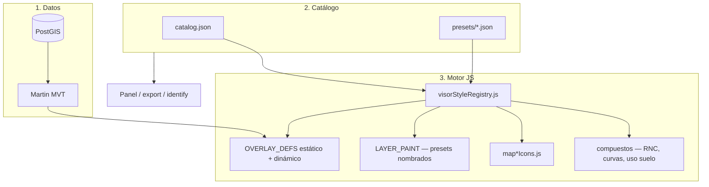

# Simbología data-driven del Visor geográfico

Documento complementario de [VISOR_CATALOG.md](./VISOR_CATALOG.md). Describe **cómo se declara y pinta la simbología** de las capas del visor, qué hace el catálogo solo y qué requiere código adicional.

**Alcance:** solo el **Visor geográfico** (`geo_visor`). No aplica a Datos geográficos, explorador municipal ni Inventario de viviendas.

---

## Respuesta directa

| Pregunta | Respuesta |
|----------|-----------|
| ¿La simbología se hereda sola al agregar una capa al `catalog.json`? | **Depende del tipo.** Con **preset genérico** (fase C) basta catálogo + PostGIS + Martin. Con preset **nombrado**, **icono** o **compuesto** sigue haciendo falta código en `map.js` / iconos (una vez por patrón). |
| ¿Hace falta otro proceso? | **Siempre:** tabla en PostGIS y publicación Martin. **Además:** validación automática al cargar el visor (fase B). **Opcional:** `OVERLAY_DEFS` manual solo si no usas preset genérico. |
| ¿Rompe lo actual? | **No.** Las 23 capas existentes siguen en `OVERLAY_DEFS` estático; el registro **añade** overlays dinámicos para capas nuevas con presets genéricos. |

---

## Estado actual (implementación real)

```
catalog.json                    visorStyleRegistry.js          map.js
─────────────                   ─────────────────────          ────────
panel, grupos, export     ✓     valida style_preset (B)   ✓    OVERLAY_DEFS estático (capas actuales)
identify                  ✓     carga presets/*.json (C)  ✓    + _visorDynamicOverlayDefs (capas nuevas)
DENUE: style.icon_key     ✓     buildOverlayDefFromPreset      ensureOverlayLayer
leyenda preset genérico   ✓     warnings en consola
```

### Flujo al abrir el visor

1. `visorLayers.js` → `loadVisorCatalog()` lee `config/visor/catalog.json`.
2. `initVisorStyleFromCatalog()` (`visorStyleRegistry.js`):
   - Carga `config/visor/presets/*.json`.
   - **Fase B:** valida cada capa (`style_preset`, `renderer`, `overlay_key`, geometría, DENUE, etc.).
   - **Fase C:** para capas con `renderer: "overlay"` y preset genérico, construye `OVERLAY_DEFS` dinámicos y los registra en `map.js`.
3. El panel y los bindings usan el catálogo; el mapa pinta con defs estáticos + dinámicos.

Warnings de validación → consola del navegador con prefijo `[visor-style]`.

---

## Arquitectura (tres capas)



### Evolución por fases

| Fase | Estado | Qué hace |
|------|--------|----------|
| **A** | ✅ Estable | Catálogo + `OVERLAY_DEFS` manual para capas actuales |
| **B** | ✅ Implementada | `visorStyleRegistry.js` valida `style_preset` / `renderer` al cargar |
| **C** | ✅ Implementada | Presets JSON genéricos → overlays dinámicos sin tocar `map.js` |
| **D** | Parcial | Leyenda automática para presets genéricos; capas nombradas siguen en `VISOR_SYMBOLOGY` |
| **E** | ✅ Implementada | Tooltips hover data-driven (`identify`/`tooltip`) + etiquetas `labels` — [VISOR_LABELS_TOOLTIPS.md](./VISOR_LABELS_TOOLTIPS.md) |

---

## Cómo se declara la simbología

La simbología se declara en **dos lugares** según la complejidad:

### 1. En el catálogo (siempre)

Archivo: `config/visor/catalog.json` (copia servida en `htdocs/atlas_gro/config/visor/`).

Campos relevantes:

| Campo | Rol |
|-------|-----|
| `renderer` | Quién monta la capa en MapLibre (`overlay`, `overlay_denue`, `overlay_composite`, `visor_shared_*`) |
| `style_preset` | Nombre del preset (genérico o nombrado) |
| `overlay_key` | Clave única del overlay en el mapa (`ly-{overlay_key}`) |
| `geometry` | `point` \| `line` \| `polygon` — debe coincidir con el preset genérico |
| `style` | Parámetros opcionales que sobreescriben defaults del preset |
| `data.table` | Tabla Martin (`c_*`) — obligatorio para `renderer: overlay` |

### 2. En presets genéricos (fase C — capas simples)

Archivos: `config/visor/presets/*.json`

| Preset | Geometría | Tipo MapLibre | Uso típico |
|--------|-----------|---------------|------------|
| `point_default` | point | circle | Puntos sin icono propio |
| `line_simple` | line | line | Líneas simples |
| `polygon_outline` | polygon | line (+ halo) | Contorno de polígono |
| `polygon_fill` | polygon | fill | Polígono relleno |
| `line_by_attribute` | line | line | Línea: color según valor de campo |
| `point_by_attribute` | point | circle | Punto: color según valor de campo |
| `polygon_by_attribute` | polygon | fill | Polígono: relleno según valor de campo |

Cada preset define `paint` por defecto y un `style_schema` que mapea campos del bloque `style` del catálogo a propiedades MapLibre.

### Parámetros `style` por preset genérico

**`point_default`**

| Campo en `style` | Propiedad MapLibre | Default |
|------------------|-------------------|---------|
| `color` | `circle-color` | `#0d9488` |
| `radius` | `circle-radius` | `5` |
| `stroke_color` | `circle-stroke-color` | `#ffffff` |
| `stroke_width` | `circle-stroke-width` | `1` |
| `opacity` | `circle-opacity` | `0.92` |
| `minzoom` | minzoom de capa | — |

**`line_simple`**

| Campo | Propiedad | Default |
|-------|-----------|---------|
| `color` | `line-color` | `#333333` |
| `width` | `line-width` | `2` |
| `opacity` | `line-opacity` | `0.9` |

**`polygon_outline`**

| Campo | Propiedad | Default |
|-------|-----------|---------|
| `color` | `line-color` (contorno) | `#990000` |
| `halo_color` | `line-color` (halo) | `#ffffff` |
| `width` | `line-width` | `1.2` |
| `halo_width` | halo `line-width` | `2.5` |
| `opacity` | `line-opacity` | `0.95` |

**`polygon_fill`**

| Campo | Propiedad | Default |
|-------|-----------|---------|
| `color` | `fill-color` | `#dce8ef` |
| `opacity` | `fill-opacity` | `0.45` |
| `outline_color` | `fill-outline-color` | `#6b8494` |

### Presets por atributo (`*_by_attribute`)

En el bloque `style` del catálogo declare el campo y las clases valor → color:

```json
"style_preset": "line_by_attribute",
"style": {
  "field": "tipo",
  "classes": [
    { "value": 1, "color": "#22c55e", "label": "Tipo 1" },
    { "value": 2, "color": "#eab308", "label": "Tipo 2" }
  ],
  "default_color": "#94a3b8",
  "width": 2
}
```

| Campo | Obligatorio | Rol |
|-------|-------------|-----|
| `field` | Sí | Columna MVT a evaluar |
| `classes` | Sí | Array `{ value, color, label? }` |
| `default_color` | No | Color para valores no listados |

El motor genera una expresión MapLibre `match` sobre `to-string(coalesce(get field, get FIELD))`. La leyenda se arma desde `classes`.

**Requisito:** Martin debe publicar la columna `field` en el tile. Sin halos, filtros por zoom ni reglas de texto (`index-of`); eso sigue en código (RNC, uso de suelo, hidro).

Parámetros extra por preset (además de `classes`):

| Preset | Parámetros opcionales (como preset simple) |
|--------|---------------------------------------------|
| `line_by_attribute` | `width`, `opacity` |
| `point_by_attribute` | `radius`, `stroke_color`, `stroke_width`, `opacity` |
| `polygon_by_attribute` | `opacity`, `outline_color` |

Guía paso a paso: [AGREGAR_CAPA.md — Caso 6](./AGREGAR_CAPA.md#caso-6--color-por-atributo-líneas-puntos-o-polígonos).

---

## Guía rápida: nueva capa con preset genérico (fase C)

**Cuándo:** punto, línea o polígono simple, sin icono ni lógica por atributo/zoom.

**Pasos:**

1. **PostGIS** — tabla `atlas.c_mi_capa` con `gid`, `the_geom`, `cve_mun` (y columnas para identify/export).
2. **Martin** — publicar la tabla (auto_publish o `martin.yaml`).
3. **`catalog.json`** — entrada en un grupo:

```json
"mi_capa_demo": {
  "label": "Mi capa demo",
  "group": "infraestructura",
  "overlay_key": "miCapaDemo",
  "geometry": "polygon",
  "renderer": "overlay",
  "style_preset": "polygon_outline",
  "style": {
    "color": "#cc5500",
    "width": 1.5
  },
  "data": {
    "table": "c_mi_capa",
    "mun_filter": "cve_mun"
  },
  "identify": {
    "title": "Mi capa",
    "fields": [{ "column": "nombre", "label": "Nombre" }]
  },
  "capabilities": {
    "export": ["kml", "shp"]
  }
}
```

4. **Sincronizar** `config/visor/catalog.json` → `htdocs/atlas_gro/config/visor/catalog.json` (o usar Docker con volumen montado).
5. **Recargar el visor** — no hace falta editar `map.js`, `visorLayerBindings.js` ni `martinLayerStyle.js`.
6. **Probar:** toggle en panel, filtro municipal, identify, export, leyenda (automática para preset genérico).

**Reglas importantes:**

- `overlay_key` debe ser **único** y en camelCase (como las capas actuales).
- No reutilices un `overlay_key` de capa builtin (`colonias`, `manzanas`, etc.).
- `geometry` debe coincidir con el preset (`polygon` + `polygon_fill`, no `point_default`).
- Si `style_preset` es desconocido o falta `data.table`, verás warning `[visor-style]` en consola.

---

## Taxonomía de `renderer` y `style_preset`

### `renderer` (quién monta la capa)

| `renderer` | Motor | ¿Solo catálogo? |
|------------|--------|-----------------|
| `overlay` | `ensureOverlayLayer` + preset | **Sí** si preset genérico; **no** si preset nombrado sin equivalente dinámico |
| `overlay_denue` | `denueLayers.js` | Parcial — icono en `mapDenueIcons.js` |
| `overlay_composite` | `ensureRncOverlayLayers` | No — RNC en código |
| `visor_shared_martin` | `ensureThematicMartinLayers` | No — uso suelo, hidro |
| `visor_shared_composite` | capas + filtros especiales | No — curvas de nivel |

### `style_preset` (cómo se ve)

| Tipo | Ejemplos | ¿Solo catálogo? |
|------|----------|-----------------|
| **Genérico** | `point_default`, `line_simple`, `polygon_outline`, `polygon_fill` | **Sí** (fase C) |
| **Por atributo** | `point_by_attribute`, `line_by_attribute`, `polygon_by_attribute` | **Sí** (fase C+) |
| **Nombrado** | `colonias`, `clues`, `manzanas` | No — requiere fila en `OVERLAY_DEFS` |
| **DENUE** | (implícito) + `style.icon_key` | Parcial |
| **Compuesto** | `rnc_tiered` (catálogo), `curvas_nivel`, `uso_suelo` | Parcial — RNC **sí** vía catálogo; curvas/uso de suelo no |

### Presets nombrados existentes (capas actuales)

| `style_preset` | Geometría | Archivo principal |
|----------------|-----------|-------------------|
| `locs_punto` | Punto symbol | `mapLocsPuntoIcons.js` |
| `locs_atlas` | Polígono line+fill hit | `LAYER_PAINT.locsAtlas*` |
| `colonias` | Polígono line stack | `LAYER_PAINT.colonias*` |
| `ageb_urbanas` / `ageb_rurales` | Polígono line stack | `LAYER_PAINT.ageb*` |
| `manzanas` | Polígono fill (minzoom 14) | `LAYER_PAINT.manzanasFill` |
| `vialidades` | Línea line stack | `LAYER_PAINT.vialidades*` |
| `rnc_tiered` | Línea composite por zoom | `catalog.json` (`style.classes`, `style.tiers`, `style.zoom`) + `ensureTieredOverlayLayers` |
| `saneamiento_agua`, `clues`, `residuo_solido` | Punto symbol | `map*Icons.js` |
| `uso_suelo`, `hidro_*`, `curvas_nivel` | shared / composite | `map.js`, `martinLayerStyle.js` |

---

## Guía por nivel de complejidad

### Nivel 0 — Preset genérico (recomendado para capas nuevas simples)

Ver [Guía rápida: nueva capa con preset genérico](#guía-rápida-nueva-capa-con-preset-genérico-fase-c) arriba.

Archivos tocados: **solo** `catalog.json` (+ PostGIS/Martin).

---

### Nivel 1 — Reutilizar aspecto de capa existente (mismo paint, otra tabla)

**Cuándo:** misma simbología que colonias/vialidades/etc., pero **tabla y toggle propios**.

**Opción A (preferida si es geometría simple):** usar preset genérico con `style` que imite colores (ej. `polygon_outline` con `color: "#990000"` como colonias).

**Opción B:** preset nombrado + fila en `OVERLAY_DEFS` que reutilice `LAYER_PAINT`:

```javascript
{
  key: "miCapa",
  table: "c_mi_capa",
  type: "line",
  lineStack: true,
  paintHalo: LAYER_PAINT.coloniasHalo,
  paint: LAYER_PAINT.colonias,
},
```

En catálogo: `style_preset: "colonias"`, `overlay_key: "miCapa"` (distinto de `colonias`).

---

### Nivel 2 — Capa nueva con preset nombrado (patrón histórico)

1. PostGIS + Martin.
2. `catalog.json` con `style_preset` nombrado.
3. `map.js` → `OVERLAY_DEFS`.
4. `visorLayerBindings.js` — solo si no basta `overlay_key` genérico (las capas con `overlay_key` en catálogo ya usan `setOverlayActiveByKey`).
5. `visorMapLegend.js` → `VISOR_SYMBOLOGY`.
6. Sincronizar catálogo y recargar.

El registro **fase B** avisará si `overlay_key` no existe en `map.js`:

```
[visor-style] mi_capa: overlay_key "miCapa" no está en map.js — use preset genérico (...)
```

---

### Nivel 3 — Punto con icono propio (symbol)

Icono en `js/icons/` o `mapMiCapaIcons.js`, entrada `type: "symbol"` en `OVERLAY_DEFS`, leyenda con `iconItems`.

Referencia: `mapCluesIcons.js` + `clues` en `OVERLAY_DEFS`.

---

### Nivel 4 — Capa DENUE (filtro SCIAN)

```json
"denue_farmacias": {
  "renderer": "overlay_denue",
  "overlay_key": "denueFarmacias",
  "data": { "filter": { "codigo_act": [464112] } },
  "style": {
    "icon_key": "denueFarmacias",
    "label_color": "#1565c0",
    "tip_title": "Farmacias"
  }
}
```

Icono nuevo → `mapDenueIcons.js`. `denueLayers.js` lee `style` del catálogo.

Validación B: `icon_key` debe existir en `DENUE_ICON_BY_KEY`.

---

### Nivel 5 — Compuesta o por atributo

RNC, curvas maestras, uso de suelo, hidrografía — lógica en `map.js` / `martinLayerStyle.js`. El catálogo documenta `renderer` y `style_preset` pero **no basta** el JSON solo.

---

## Validación automática (fase B)

Al cargar el visor, `validateVisorLayerStyle()` comprueba:

| Caso | Qué valida |
|------|------------|
| Todas | `style_preset` presente |
| `overlay` + genérico | `overlay_key`, `data.table`, coherencia `geometry` |
| `overlay` + nombrado | `overlay_key` registrado en `OVERLAY_DEFS` |
| `overlay_denue` | `style.icon_key`, `data.filter.codigo_act` |
| `overlay_composite` | preset `rnc_tiered`, `data.table`, `style.tiers` / `style.classes` |
| `visor_shared_*` | `overlay_key` presente |

Los warnings no bloquean la app; indican configuración incompleta antes de probar en mapa.

---

## Motor interno (fase C)

### `visorStyleRegistry.js`

| Función | Rol |
|---------|-----|
| `loadGenericPresets()` | Fetch de `presets/*.json` |
| `validateVisorLayerStyle()` | Validación por capa |
| `buildOverlayDefFromGenericPreset()` | Catálogo + preset → def MapLibre |
| `buildRncTieredOverlayDefFromPreset()` | Catálogo + preset `rnc_tiered` → def composite |
| `initVisorStyleFromCatalog()` | Orquesta carga, validación y registro |
| `buildGenericLegendForLayer()` | Leyenda para panel de simbología |

### `map.js`

| Función | Rol |
|---------|-----|
| `registerVisorDynamicOverlayDefs()` | Recibe defs construidos desde el registro |
| `remountVisorDynamicOverlayLayers()` | Recrea capas dinámicas en el mapa activo |
| `allOverlayDefs()` | Estático + dinámico (uso interno) |
| `hasVisorOverlayDef()` / `isBuiltinOverlayKey()` | Consulta para registro y validación |
| `ensureTieredOverlayLayers()` | Capas estatal / troncal / detalle + warm (RNC) |

Las capas con preset genérico (`overlay`) o composite (`overlay_composite` + `rnc_tiered`) se registran en `_visorDynamicOverlayDefs`. El array estático `OVERLAY_DEFS` queda vacío salvo futuras excepciones.

---

## Leyenda del visor

- **Capas actuales y DENUE:** `visorMapLegend.js` → `VISOR_SYMBOLOGY` (hardcodeado).
- **Capas con preset genérico:** leyenda derivada de `style` + defaults del preset (`buildGenericLegendForLayer`).
- **Futuro (fase D):** bloque `legend` opcional en catálogo para todos los tipos.

---

## Martin y atributos

El estilo MapLibre lee propiedades del **MVT**. Columnas usadas en `match`, etiquetas o identify deben estar publicadas en Martin (`martin.yaml` / auto_publish).

---

## Qué duplicar por capa

| Componente | ¿Por capa? |
|------------|------------|
| `catalog.json` | Sí |
| `presets/*.json` | No — biblioteca compartida |
| `OVERLAY_DEFS` | No si preset genérico; sí si nombrado/icono |
| `LAYER_PAINT` | No — reutilizar preset nombrado |
| `identify` | No en JS — bloque en catálogo |
| Export backend | No — `data` en catálogo |
| Iconos | Solo symbol con icono nuevo |

---

## Resumen operativo

```
Capa nueva en el visor =
  ① PostGIS + Martin
  ② catalog.json (renderer + style_preset + overlay_key + data + identify)
  ③ Si geometría simple → preset genérico (point_default | line_simple | polygon_*)
     Si icono / compuesta / nombrada sin equivalente → map.js + iconos + leyenda
  ④ Abrir visor → revisar consola [visor-style]
  ⑤ Probar: mapa + leyenda + identify + export
```

---

## Archivos de referencia

| Archivo | Rol |
|---------|-----|
| `config/visor/catalog.json` | Declaración de capas y `style` |
| `config/visor/presets/*.json` | Presets genéricos reutilizables |
| `js/visorStyleRegistry.js` | Validación (B) y construcción dinámica (C) |
| `js/map.js` | `OVERLAY_DEFS` estático + registro dinámico |
| `js/martinLayerStyle.js` | `LAYER_PAINT`, presets nombrados |
| `js/denueLayers.js` | DENUE desde catálogo |
| `js/visorMapLegend.js` | Leyenda panel activo |
| `js/visorLayers.js` | Invoca `initVisorStyleFromCatalog` al cargar |
| `docs/VISOR_CATALOG.md` | Alta de capa (datos + panel) |

---

*Última actualización: fases B y C implementadas en el visor geográfico. Las capas existentes no cambian de comportamiento.*
