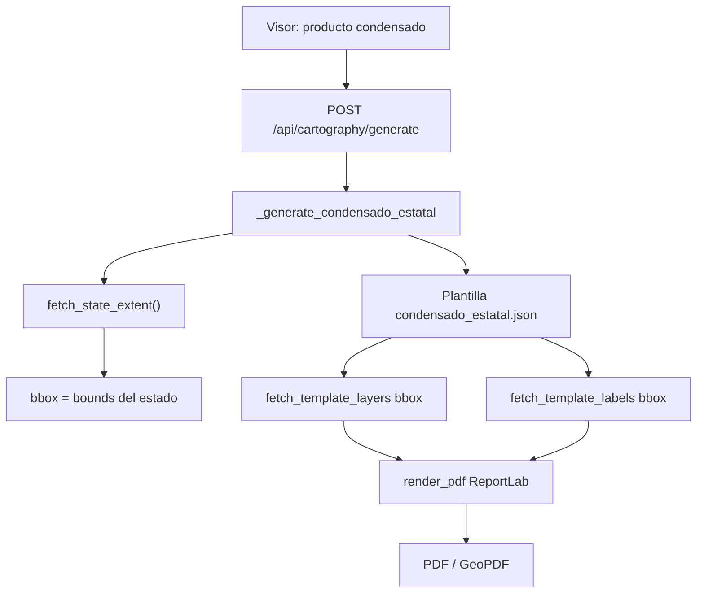

# Context — Cómo estamos construyendo el condensado estatal

> Documento narrativo / de diseño (22 jul 2026, noche) · Engine **`1.12.49`**  
> Handoff operativo corto: [`CONTEXT_CONDENSADO_ESTATAL.md`](./CONTEXT_CONDENSADO_ESTATAL.md)  
> Doc general del motor: [`CARTOGRAPHY_ENGINE.md`](./CARTOGRAPHY_ENGINE.md)  
> Índice: [`context.md`](./context.md)

---

## 1. Qué es el condensado (en GroSIG)

El **condensado estatal** es un plano de **gran formato** que muestra el estado completo (Guerrero, `cve_ent = 12`) con el **marco geoestadístico** y una selección reducida de temas: hidrología perenne, vías principales, localidades urbanas de área, límites y aeropuertos.

**No es** una captura del visor MapLibre. El motor:

1. Lee geometrías y atributos desde PostGIS (`GroSIG_Cartography`).
2. Compone un PDF **100 % vectorial** con ReportLab.
3. Usa plantilla JSON + layout plotter propios del producto.

Meta de negocio: acercarnos al condensado de referencia generado por otros medios (INEGI / GEPROCEN), sin romper croquis ni planos de localidad.

---

## 2. Referencia visual (meta)

| Pieza | Ruta |
|-------|------|
| Referencia INEGI/GEPROCEN | `d:\respaldo comite estatal 2025\escritorio\victor\GEPROCEN_CE_2024\PDFS\COND-CROQ\CONDENSADO-ESTATAL\12 Guerrero\Guerrero_GEO_ED.pdf` |
| Salida smoke del engine | `C:\Stack_Martin\smoke_out\condensado.pdf` |

El PDF de referencia es mayormente **ráster**; se usa como guía de:

- Título: *CONDENSADO ESTATAL CON MARCO GEOESTADÍSTICO*
- Panel lateral: SIMBOLOGÍA, CLAVES, VÍAS…
- Contenido de mapa a escala estatal
- Barra de escala en metros

Aún **no** tenemos paridad total de panel/tipografía; primero estabilizamos **contenido + tiempo de generación**, luego afinamos por bloques visuales.

---

## 3. Papel y layout

| Concepto | Valor |
|----------|--------|
| Papel canónico | `plotter_90x120` |
| Orientación | `landscape` |
| Tamaño real | **120 cm × 90 cm** (ancho × alto) |
| MediaBox típico | `[0 0 3401.57 2551.18]` pt |
| Preset | `grosig_condensado` |
| Zoom / pad | `pad_ratio = 0.04` sobre el extent del estado |

**Importante:** el croquis municipal usa **90×70**. Son productos distintos; no se mezclan presets ni paneles.

---

## 4. Arquitectura del pipeline



### Piezas de código

| Rol | Archivo / símbolo |
|-----|-------------------|
| Entrada API | `cartography_engine/router.py` → `generate` |
| Orquestación | `services/__init__.py` → `_generate_condensado_estatal` |
| Capas (qué dibujar) | `templates/condensado_estatal.json` |
| Extent del estado | `datasource.fetch_state_extent` |
| Fetch geom/etiquetas | `fetch_template_layers` / `fetch_template_labels` (con `bbox`) |
| Dibujo PDF | `pdf/__init__.py` → `render_pdf` / `draw_map_page` |
| UI | `htdocs/atlas_gro/js/cartographyClient.js` (`product === "condensado"`) |

### Regla de aislamiento

Cambios del condensado viven en:

- `condensado_estatal.json`
- `_generate_condensado_estatal` (y params exclusivos de ese path)

**No** se tocan: croquis 90×70, PLU/PLR, ni `pad_ratio` del croquis, salvo petición explícita.

---

## 5. Cómo se arma un PDF (paso a paso)

1. **Extent estatal**  
   Se obtiene el polígono/bounds de la entidad (Guerrero) desde MGN.

2. **Plantilla**  
   Se parsean capas, símbolos, filtros, `limit`, `simplify`, etiquetas.

3. **Filtro espacial**  
   Se pasa **solo `bbox`** del estado a las consultas (sin `clip_geom` Python).  
   Motivo: si no hay bbox, capas `info50k` con `LIMIT` pueden traer tramos de **todo el país** y el producto se vuelve inutilizable.

4. **Fetch de geometrías**  
   Una consulta por capa (PostGIS → GeoJSON → Shapely), con `optional: true` donde aplica.

5. **Fetch de etiquetas**  
   Misma plantilla; tope global de colisión acotado (~220) porque a escala estatal la resolución de solapes es cara.

6. **Layout**  
   Marco de mapa + leyenda + norte + escala + branding SEPLADER/CESIEG.

7. **Render**  
   ReportLab dibuja vectores en canvas 120×90 cm y emite bytes PDF.

8. **Logs de tiempo** (diagnóstico)  
   En `docker logs fastapi_backend` aparece algo como:

   `condensado Guerrero: layers=…s labels=…s render=…s total=…s feats=… labs=… bytes=…`

---

## 6. Contenido cartográfico actual (1.12.42)

Decisión reciente del usuario: **menos capas, más velocidad**, acercándonos a lo esencial del marco.

### Incluido

| Capa (`id`) | Tabla | Rol |
|-------------|--------|-----|
| `municipios` | `mgn.municipios_a` | Etiquetas `cve_mun` + nombre (trazo casi invisible) |
| `localidades_urbana` | `mgn.localidades_a` | Polígonos urbanos (`ambito` Urbana, `cve_ent` 12) |
| `cuerpos` | `info50k.cuerpos_agua_a` | Agua **PERENNE** (`simplify` 150 m) |
| `corrientes` | `info50k.corrientes_agua_l` | Corrientes **PERENNE** (`simplify` 200 m) |
| `carreteras_multi` | `info50k.carreteras_l` | Carretera **doble línea** (&gt;2 carriles: 3–4; `simplify` 100 m) |
| `municipios_l` | `mgn.municipios_l` | Límite municipal (dash verde; `simplify` 80 m) |
| `estados_l` | `mgn.estados_l` | Límite estatal (cruces rojas `+++`; `simplify` 50 m) |
| `aeropuerto_intl` / `aeropuerto_local` | `info50k.aeropuertos_p` | Aeropuertos |

### Excluido a propósito

- Localidades rurales amanzanadas  
- Carreteras de 1 y 2 carriles  
- Cortinas / bordos  
- Ferrocarril  
- Temas intermitentes de hidrología  

Si más adelante se pide “también 2 carriles con doble trazo”, se suma como capa propia del condensado, sin tocar el croquis.

---

## 7. Rendimiento: qué aprendimos

### Objetivo

Generar en **menos de ~3 minutos**, como en las primeras pruebas del producto.

### Lo que **no** es la solución principal

Subir timeouts de Nginx/Gunicorn a 10–15 minutos. Eso solo evita el corte; no arregla el costo.

### Lo que sí rompía / ralentizaba

| Problema | Efecto | Mitigación |
|----------|--------|------------|
| Fetch sin `bbox` | `LIMIT` nacional en `info50k` | `bbox` del estado en el path condensado |
| `clip_geom` + intersection Python | CPU alta sobre multipolígonos | Quitado; solo envelope SQL |
| Hatch en miles de polígonos rurales | Render muy lento en plotter | Rural fuera del producto reducido |
| Demasiadas capas / límites altos | Minutos de fetch+draw | Plantilla reducida 1.12.41+ |
| GeoJSON + vértices densos | Parse/serialize caro | WKB + simplify escala (1.12.42) |
| Un `drawPath` por tramo | Render ReportLab lento | Path compuesto por capa (1.12.42) |
| Gunicorn default **120 s** | Worker muerto a mitad | Safety `TIMEOUT≈300` |
| Nginx 504 ~5 min | Archivo “PDF” de ~167 B = HTML `504 Gateway Time-out` | `proxy_read_timeout` cartography + job más corto |

### Curl “atascado en 63 %”

No es progreso del mapa. El body del POST pesa **63 bytes**; curl muestra eso subido y **0 recibidos** hasta que el backend termina. Es normal.

---

## 8. Timeouts (red de seguridad)

| Capa | Valor orientativo | Dónde |
|------|-------------------|--------|
| Gunicorn | `TIMEOUT` / `GRACEFUL_TIMEOUT` ≈ 300 s | `docker-compose.yml` → `api_backend` |
| Nginx `/api/cartography/` | `proxy_read_timeout` ≈ 360 s | `nginx/default.conf` |
| curl smoke | `--max-time 360` | Comando local |

Tras cambiar compose/nginx: recrear `api_backend` y `nginx_proxy`.

---

## 9. Paridad visual vs referencia (roadmap)

Trabajar **un bloque por iteración**; regenerar y comparar con `Guerrero_GEO_ED.pdf`.

### Bloque A — Contenido de mapa (en curso)

Capas esenciales ya definidas (1.12.42). Ajustar densidades/`simplify` si el tiempo o el vacío visual lo piden.

### Bloque B — Panel / tira lateral

Como el croquis tiene `croquis_panel.py`, el condensado necesitará **panel propio** (o parametrizado), sin romper el 90×70:

- SIMBOLOGÍA  
- CLAVES con líderes  
- VÍAS  
- Proyección / fuente / fecha  

### Bloque C — Tipografía y etiquetas (activo 1.12.49)

Meta: **~70–90% de localidades urbanas** con etiqueta + más nombres de corrientes.

- SQL: `ORDER BY ST_Area DESC` en etiquetas de `localidades_*`.
- Colisión: prioriza el orden de entrada en capas de área (las grandes ganan).
- Limits: urbana 500 / corrientes 350 / cuerpos 120; tope path 1100; pases PDF loc≤700 hidro≤400.
- Along hidro: más permisivo (hasta 6/nombre, sep ~1.6 km).

**Siguiente paso:** regenerar smoke, contar cobertura visual vs `Guerrero_GEO_ED.pdf`, afinar pad/size si hace falta.

### Bloque D — Branding y pie

Título oficial, logos, nota metodológica alineada al insumo.

---

## 10. Cómo regenerar y validar

```bat
cd /d C:\Stack_Martin
docker compose up -d --force-recreate api_backend nginx_proxy
timeout /t 12 /nobreak
curl -s http://localhost:850/api/cartography/health
```

Esperado: `"version":"1.12.49"`, `"timeout": 300` (aprox.).

```bat
del smoke_out\condensado.pdf
curl -X POST http://localhost:850/api/cartography/generate -H "Content-Type: application/json" -d "{\"template_id\":\"condensado_estatal\",\"format\":\"pdf\",\"params\":{}}" --output smoke_out\condensado.pdf --max-time 360
dir smoke_out\condensado.pdf
docker logs --tail 30 fastapi_backend
```

PDF bueno: empieza por `%PDF`, varios MB.  
PDF malo (~167 B): suele ser HTML `504` — el proxy cortó; mirar logs `layers/labels/render`.

---

## 11. Prompt corto para un chat nuevo

```
Continúa el condensado estatal GroSIG en C:\Stack_Martin.
Lee: htdocs/atlas_gro/docs/context-condensado.md
y el handoff: htdocs/atlas_gro/docs/CONTEXT_CONDENSADO_ESTATAL.md
Producto: condensado_estatal (120×90 cm). Engine ~1.12.49.
Objetivo: densificar etiquetas urbanas (~70–90%) + hidrónimos; acercar a Guerrero_GEO_ED.pdf.
No tocar croquis/PLU/PLR. Config solo condensado.
Responde en español.
```

---

## 12. No hacer

- Mezclar layout/panel del croquis 90×70 con el condensado 120×90.  
- Quitar el `bbox` del path condensado.  
- “Arreglar” lentitud solo subiendo timeouts.  
- Meter de nuevo rural / 1–2 carriles / FFCC sin acuerdo (rompe el presupuesto de tiempo).  
- Romper PLU/PLR al tocar `fetch_layer` genérico: el condensado debe usar opciones solo en su orquestación.
